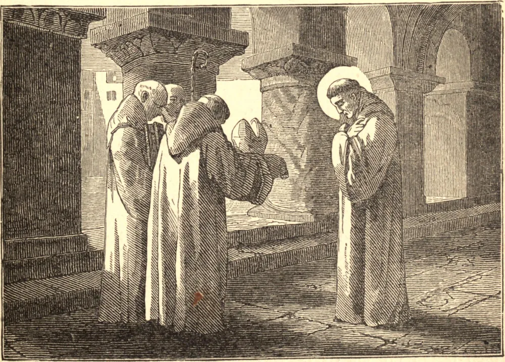

# ST. HUGH, Abbot of Cluny

ST. HUGH was a prince related to the sovereign house of the dukes of Burgundy, and had his education under the tuition of his pious Mother, and under the care of Hugh, Bishop of Auxerre, his great-uncle. From his infancy he was exceedingly given to prayer and meditation, and his life was remarkably innocent and holy. One day, hearing an account of the wonderful sanctity of the monks of Cluny, under St. Odilo, he was so moved that he set out that moment, and going thither, humbly begged the monastic habit. After a rigid novitiate, he made his profession in 1039, being sixteen years old. His extraordinary virtue, especially his admirable humility, obedience, charity, sweetness, prudence, and zeal, gained him the respect of the whole community; and upon the death of St. Odilo, in 1049, though only twenty-five years old, he succeeded to the government of that great abbey, which he held sixty-two years. He received to the religious profession Hugh, Duke of Burgundy, and died on the twenty-ninth of April, in 1109, aged eighty-five. He was canonized twelve years after his death by Pope Calixtus II.
