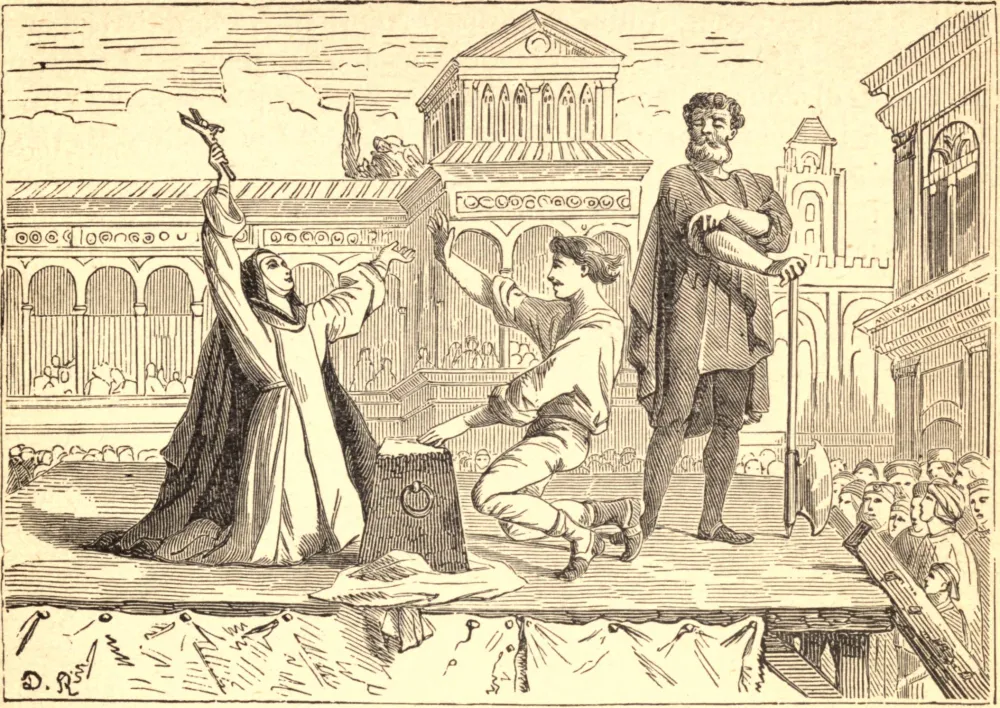

# April 30.—ST. CATHERINE OF SIENA

CATHERINE, the daughter of a humble tradesman, was raised up to be the guide and guardian of the Church in one of the darkest periods of its history, the fourteenth century. As a child, prayer was her delight. She would say the "Hail Mary" on each step as she mounted the stairs, and was granted in reward a vision of Christ in glory. When but seven years old, she made a vow of virginity, and afterwards endured bitter persecution for refusing to marry. Our Lord gave her His Heart in exchange for her own, communicated her with His own hands, and stamped on her body the print of His wounds. At the age of fifteen she entered the Third Order of St. Dominic, but continued to reside in her father's shop, where she united a life of active charity with the prayer of a contemplative Saint. From this obscure home the seraphic virgin was summoned to defend the Church's cause. Armed with Papal authority, and accompanied by three confessors, she travelled through Italy, reducing rebellious cities to the obedience of the Holy See, and winning hardened souls to God. In the face well-nigh of the whole world she sought out Gregory XI. at Avignon, brought him back to Rome, and by her letters to the kings and queens of Europe made good the Papal cause. She was the counsellor of Urban VI., and sternly rebuked the disloyal cardinals who had part in electing an antipope. Long had the holy virgin foretold the terrible schism which began ere she died. Day and night she wept and prayed for unity and peace. But the devil excited the Roman people against the Pope, so that some sought the life of Christ's Vicar. With intense earnestness did St. Catherine beg Our Lord to prevent this enormous crime. In spirit she saw the whole city full of demons tempting the people to resist and even slay the Pope. The seditious temper was subdued by Catherine's prayers; but the devils vented their malice by scourging the Saint herself, who gladly endured all for God and His Church. She died at Rome, in 1380, at the age of thirty-three.

## Reflection

The seraphic St. Catherine willingly sacrificed the delights of contemplation to labor for the Church and the Apostolic See. How deeply do the troubles of the Church and the consequent loss of souls afflict us? How often do we pray for the Church and the Pope?
