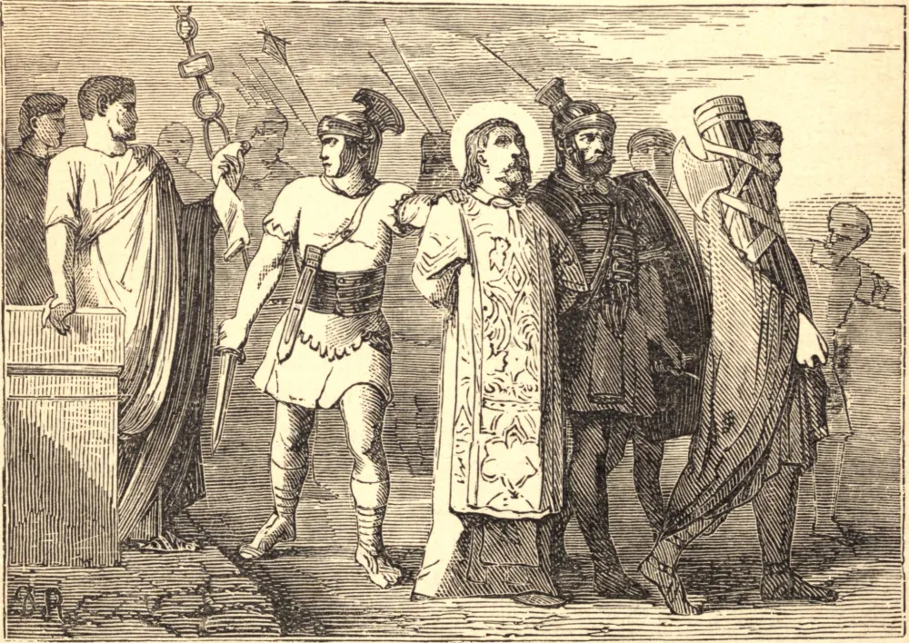

# August 8.—ST. CYRIACUS and His Companions, Martyrs

ST. CYRIACUS was a holy deacon at Rome, under the Popes Marcellinus and Marcellus. In the persecution of Diocletian, in 303, he was crowned with a glorious martyrdom in that city. With him suffered also Largus and Smaragdus, and twenty others. Their bodies were first buried near the place of their execution, on the Salarian Way, but were soon after removed to a farm of the devout Lady Lucina, on the Ostian Road, on the eighth day of August.

**Reflection**—To honor the martyrs and duly celebrate their festivals, we must learn their spirit and study to imitate them according to the circumstances of our state. We must, like them, resist evil, must subdue our passions, suffer afflictions with patience, and bear with others without murmuring or complaining. The cross is the ladder by which we must ascend to heaven.
