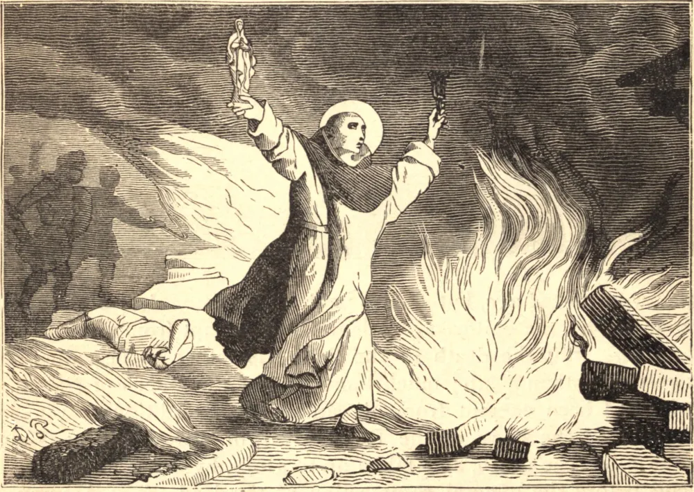

# August 16.—ST. HYACINTH

HYACINTH, the glorious apostle of Poland and Russia, was born of noble parents in Poland, about the year 1185. In 1218, being already Canon of Cracow, he accompanied his uncle, the bishop of that place, to Rome. There he met St. Dominic, and received the habit of the Friar Preachers from the patriarch himself, of whom he became a living copy. So wonderful was his progress in virtue that within a year Dominic sent him to preach and plant the Order in Poland, where he founded two houses.

His apostolic journeys extended over numerous regions. Austria, Bohemia, Livonia, the shores of the Black Sea, Tartary, and Northern China on the east, and Sweden and Norway to the west, were evangelized by him, and he is said to have visited Scotland. Everywhere multitudes were converted, churches and convents were built; one hundred and twenty thousand pagans and infidels were baptized by his hands. He worked numerous miracles, and at Cracow raised a dead youth to life. He had inherited from St. Dominic a most filial confidence in the Mother of God; to her he ascribed his success, and to her aid he looked for his salvation.

When St. Hyacinth was at Kiev the Tartars sacked the town, but it was only as he finished Mass that the Saint heard of the danger. Without waiting to unvest, he took the ciborium in his hands, and was leaving the church. As he passed by an image of Mary a voice said: "Hyacinth, my son, why dost thou leave me behind? Take me with thee, and leave me not to mine enemies." The statue was of heavy alabaster, but when Hyacinth took it in his arms it was light as a reed. With the Blessed Sacrament and the image he came to the river Dnieper, and walked dry-shod over the surface of the waters.

On the eve of the Assumption he was warned of his coming death. In spite of a wasting fever, he celebrated Mass on the feast, and communicated as a dying man. He was anointed at the foot of the altar, and died the same day, 1257.

**Reflection**—St. Hyacinth teaches us to employ every effort in the service of God, and to rely for success not on our own industry, but on the prayer of His Immaculate Mother.
