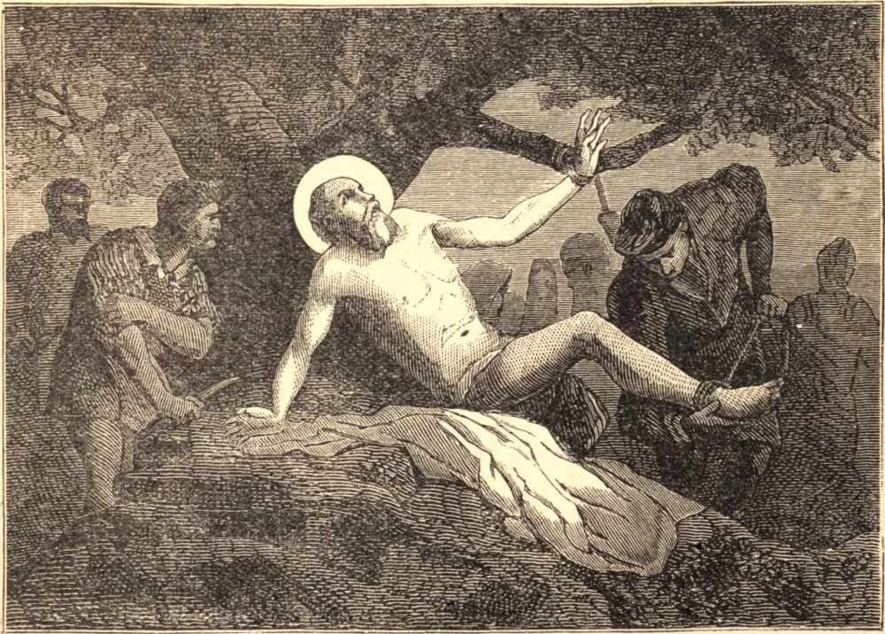

# August 24.—ST. BARTHOLOMEW, Apostle

ST. BARTHOLOMEW was one of the twelve who were called to the apostolate by our blessed Lord Himself. Several learned interpreters of the Holy Scripture take this apostle to have been the same as Nathaniel, a native of Cana, in Galilee, a doctor in the Jewish law, and one of the seventy-two disciples of Christ, to whom he was conducted by St. Philip, and whose innocence and simplicity of heart deserved to be celebrated with the highest eulogium by the divine mouth of Our Redeemer. He is mentioned among the disciples who were met together in prayer after Christ's ascension, and he received the Holy Ghost with the rest.

Being eminently qualified by the divine grace to discharge the functions of an apostle, he carried the Gospel through the most barbarous countries of the East, penetrating into the remoter Indies. He then returned again into the northwest part of Asia, and met St. Philip, at Hierapolis, in Phrygia. Hence he travelled into Lycaonia, where he instructed the people in the Christian Faith; but we know not even the names of many of the countries in which he preached.

St. Bartholomew's last removal was into Great Armenia, where, preaching in a place obstinately addicted to the worship of idols, he was crowned with a glorious martyrdom. The modern Greek historians say that he was condemned by the governor of Albanopolis to be crucified. Others affirm that he was flayed alive, which might well enough consist with his crucifixion, this double punishment being in use not only in Egypt, but also among the Persians.

**Reflection**—The characteristic virtue of the apostles was zeal for the divine glory, the first property of the love of God. A soldier is always ready to defend the honor of his prince, and a son that of his father; and can a Christian say he loves God who is indifferent to His honor?
