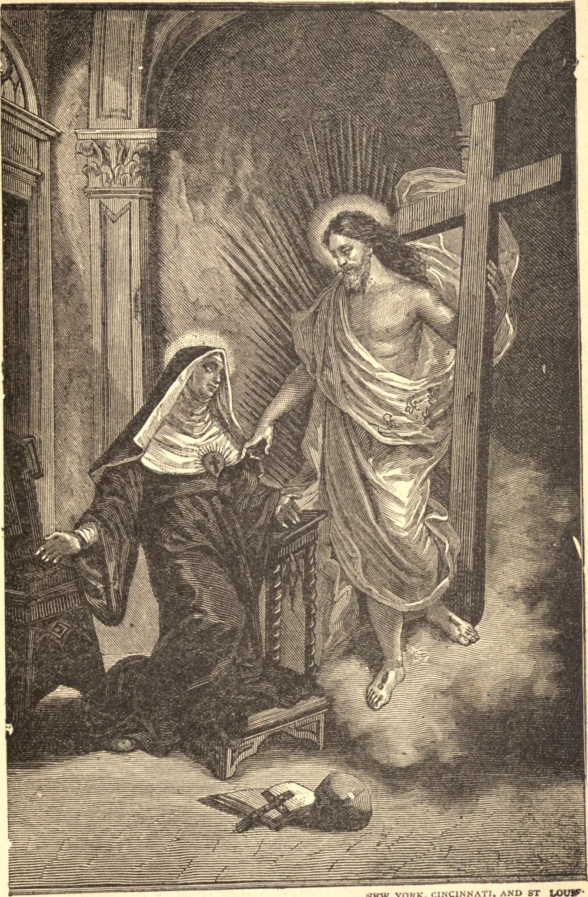

# St. Clare of Montefalco

St. Clare was born in 1268, in the little Italian town from which she takes her name. Her parents were thoroughly pious people, in moderate circumstances, to whom were born two daughters, Johanna, who was the elder, and the subject of our sketch. While still a child, Johanna, with the consent of her parents, withdrew to a secluded spot known as St. Leonards, where, with other maidens of her own age and disposition, she gave herself up to prayer and the service of God, although not bound by any rule. From her very infancy Clare wished to join her sister, and at the tender age of six she actually persuaded her parents to give their consent, and was received into the community. The community grew so rapidly that St. Leonards was soon too small. Accordingly, it was decided to remove to the summit of St. Catherine's Hill, over which a cross of light followed by a procession of prayerful women had been once seen in a vision by Johanna. Believing this to be a sign from God indicating their new home, the pious women, after many obstacles, built an humble monastery on the spot. Up to this time the community supported itself partly by its own labor and partly by the assistance received from its friends; but now they began to feel the want of means of subsistence, and finally it was decided that some of the Sisters should be sent out to beg. The repulses, mortifications, and fatigue attendant upon such work attracted Clare, and she begged her sister to assign the task to her. Having received the necessary permission, she started out with Sister Marina for a companion. From house to house she went, but always remained at the door, so that of all the families which she visited none could say that she ever entered the house. As she walked along, her mind was ever intent on heavenly things, and she would often stand for a time as though absorbed in ecstasy. Fearing some accident might happen to her while in this state, Blessed Johanna forbade her to go out again.

Believing that it would be in every way a benefit, the community decided to erect their establishment into a convent; and having referred the matter to the bishop of their diocese, he agreed with them, and gave them the rule of St. Augustine. They called their house the Convent of the Holy Cross, and elected Johanna as their Abbess. She was not to remain long at their head, for in a year from the time of her election she passed away to enjoy the reward which her labors had earned for her. Although only twenty-three years of age, Clare was chosen Abbess in her sister's place. The wisdom of their choice was at once apparent, for her exemplary life became a living rule, encouraging and correcting all and making perseverance easy. She was attentive to the bodily needs of her community, so that no anxiety on that score might interfere with their spirit of prayer. Poverty, the constant recollection of God's majesty, devotion to the Passion of Our Lord, love of one's neighbor, and bountiful almsgiving were among the practices she endeavored to develop in her nuns both by her teaching and example.

From her tenderest years she had been accustomed to meditate with rapt attention on the scenes in the Passion of Our Saviour. She had reached the age of thirty-three, when one day she felt more than an ordinary attraction for this holy exercise; she felt her heart inflamed with the most intense feelings of love and compassion, and her soul wholly absorbed in the contemplation of those mysteries. Suddenly a flood of light deluged the room, and she saw standing before her Our Saviour Himself, bearing His Cross. Turning towards her, He said that He wished to plant that very Cross in her heart; and on the instant not only was the Cross implanted there, but all the mysteries of the Passion were impressed upon and depicted in the cavity of that same heart, where they remained and still remain to this day. When our Saint died, her body was opened and her heart divided, and there, formed by flesh and veins, were found the image of Our Crucified Saviour, with the pillar, the crown of thorns, the three nails, the lance, and the reed with the sponge.

By God's dispensation, Clare's reputation for sanctity increased. From far and near the people came to see her, and to beg her prayers. The sick and dying were carried to her, and healed at her touch, and the gift of prophecy was granted her. Many learned men, theologians and philosophers, propounded to her the most abstruse questions, to which they received wonderful and correct answers. On more than one occasion she was led into disputes with heretics, and invariably sent them from her overwhelmed with confusion.

Shortly after Our Lord made for Himself a temple in Clare's heart, she formed the resolution of building for Him a church in place of the old one of St. Catherine, which the poverty of the community had obliged them to use up to that time. Relying on God's help and the kindness of friends and benefactors, Clare set about the work, and in less than a year, to the surprise of every one, the whole church was completed. It seemed as though our Saint could never tear herself away from this church. There she spent many hours of the day and a great part of the night; thither she caused herself to be borne by her religious when she was sick; there she wished to breathe her last sigh, and thence wing her flight to heaven.

August of the year 1308 was now approaching, and with it the day of our Saint's life was drawing to a close. Our Lord had told her, years before, when the end would come. For nearly two years before her death she was confined to her bed, leaving it only at rare intervals. When the morning of the Feast of the Assumption came, the Saint sent for her confessor and made her last sacramental confession. She then begged that the holy Viaticum might be brought to her, being certain, as she herself predicted and as really happened, that she would never receive it again in this life. After receiving the Blessed Sacrament, she asked to be left alone, so that no earthly object might rob her of a glance or a thought, and that she might give free vent to the current of her affections. Towards evening she caused the religious to be assembled around her, and, after a few short words of love and advice, gave them all her blessing. She afterwards received Extreme Unction with sentiments becoming a saint, amid the tears of her spiritual daughters. During the whole of the following day, her time was spent in communion with God, and her face assumed such an appearance of health that many supposed she was growing better. But it was not to be, and in the forenoon of the 17th of August, 1308, those about her saw descending swiftly from on high a brilliant light which irradiated her countenance. This light shortly after took the form of a globe and disappeared, and with it departed the pure soul of Clare, to enter into the haven of everlasting happiness.
