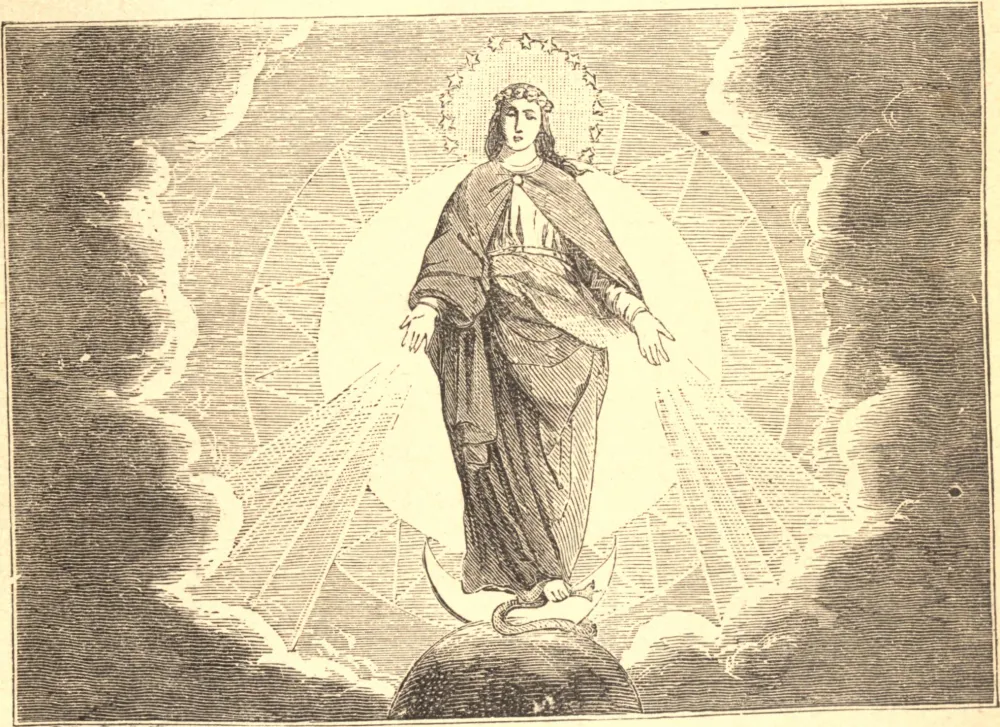

# December 8.—THE FEAST OF THE IMMACULATE CONCEPTION

ON this day, so dear to every Catholic heart, we celebrate, in the first place, the moment in which Almighty God showed Mary, through the distance of ages, to our first parents as the Virgin Mother of the divine Redeemer, the woman destined to crush the head of the serpent. And as by eternal decree she was miraculously exempt from all stain of original sin, and endowed with the richest treasures of grace and sanctity, it is meet that we should honor her glorious prerogatives by this special feast of the Immaculate Conception. We should join in spirit with the blessed in heaven, and rejoice with our dear Mother, not only for her own sake, but for ours, her children, who are partakers of her glory and happiness.

Secondly, we are called upon to celebrate that ever-memorable day, the 8th of December, 1854, which raised the Immaculate Conception of Our Blessed Lady from a pious belief to the dignity of a dogma of the Infallible Church, causing universal joy among the faithful.

**Reflection**—Let us repeat frequently these words applied by the Church to the Blessed Virgin: "Thou art all fair, O Mary, and there is not a spot in thee" (Cant. iv. 7).
