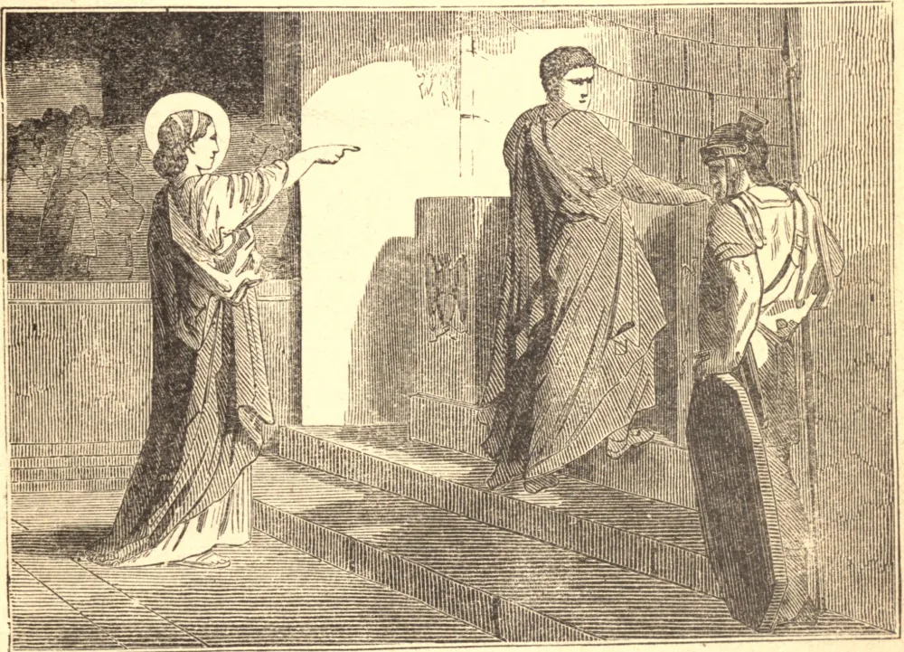

# December 10.—ST. EULALIA, Virgin, Martyr

ST. EULALIA was a native of Merida, in Spain. She was but twelve years old when the bloody edicts of Diocletian were issued. Eulalia presented herself before the cruel judge Dacianus, and reproached him for attempting to destroy souls by compelling them to renounce the only true God. The governor commanded her to be seized, and at first tried to win her over by flattery, but failing in this, he had recourse to threats, and caused the most dreadful instruments of torture to be placed before her eyes, saying to her: "All this you shall escape if you will but touch a little salt and frankincense with the tip of your finger." Provoked at these seducing flatteries, our Saint threw down the idol, and trampled upon the cake which was laid for the sacrifice. At the judge's order, two executioners tore her tender sides with iron hooks, so as to leave the very bones bare. Next lighted torches were applied to her breasts and sides; under which torment, instead of groans, nothing was heard from her mouth but thanksgivings. The fire at length catching her hair, surrounded her head and face, and the Saint was stifled by the smoke and flame.

## Reflection

The apostles rejoiced "that they were accounted worthy to suffer reproach for the name of Jesus." Do we bear our crosses with the same spirit?
