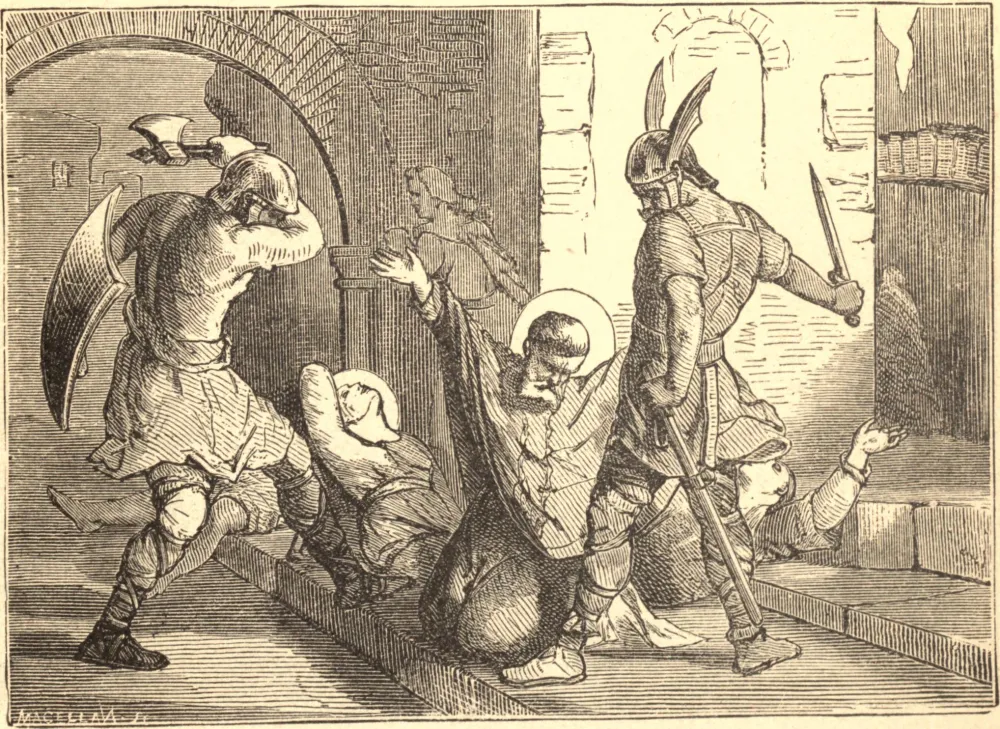

# December 14.—ST. NICASIUS, Archbishop, and his Companions, Martyrs

IN the fifth century an army of barbarians from Germany ravaging part of Gaul, plundered the city of Rheims. Nicasius, the holy bishop, had foretold this calamity to his flock. When he saw the enemy at the gates and in the streets, forgetting himself, and solicitous only for his spiritual children, he went from door to door encouraging all to patience and constancy, and awaking in every breast the most heroic sentiments of piety and religion. In endeavoring to save the lives of his flock he exposed himself to the swords of the infidels, who, after a thousand insults and indignities, cut off his head. Florens, his deacon, and Jocond, his lector, were massacred by his side. His sister Eutropia, a virtuous virgin, fearing she might be reserved for a fate worse than death, boldly cried out to the infidels that it was her unalterable resolution rather to sacrifice her life than her faith or her integrity and virtue. Upon which they despatched her with their cutlasses.

## Reflection

Bear patiently and sweetly bodily sufferings, and prepare for the day of trial by the courageous endurance of the daily crosses incident to your state.
