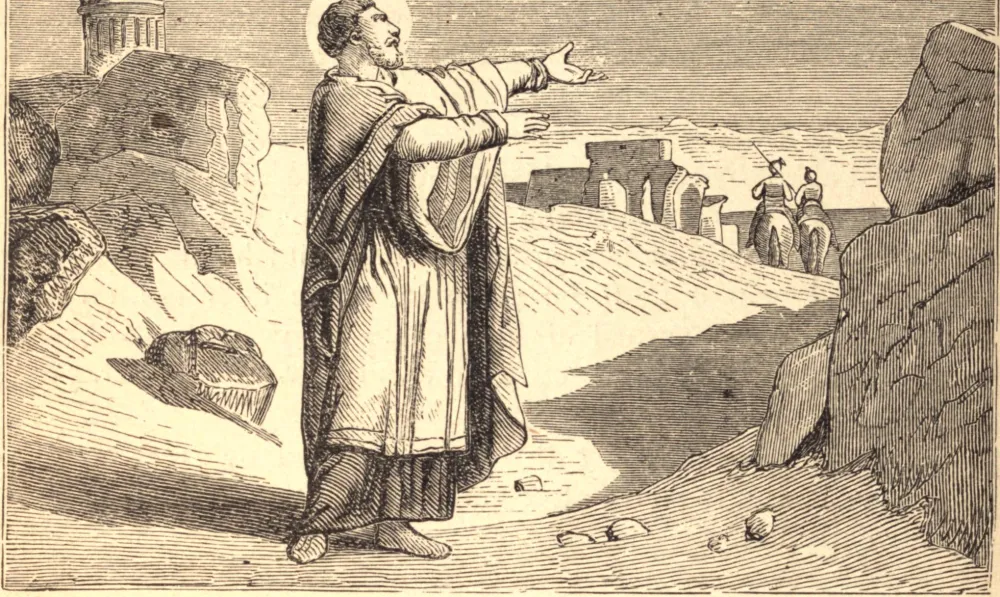

# December 16.—ST. EUSEBIUS, Bishop

ST. EUSEBIUS was born of a noble family, in the island of Sardinia, where his father is said to have died in prison for the Faith. The Saint's mother carried him and his sister, both infants, to Rome.

Eusebius having been ordained, served the Church of Vercelli with such zeal that on the episcopal chair becoming vacant he was unanimously chosen, by both clergy and people, to fill it. The holy bishop saw that the best and first means to labor effectually for the edification and sanctification of his people was to have a zealous clergy. He was at the same time very careful to instruct his flock, and inspire them with the maxims of the Gospel. The force of the truth which he preached, together with his example, brought many sinners to a change of life.

He courageously fought against the heretics, who had him banished to Scythopolis, and thence to Upper Thebais in Egypt, where he suffered so grievously as to win, in some of the panegyrics in his praise, the title of martyr. He died in the latter part of the year 371.

**Reflection**—The routine of every-day, commonplace duties is no hindrance to a free intimacy with God. He will disclose His hidden ways to you in proportion as you follow your vocation faithfully, whether in the world or the cloister.
