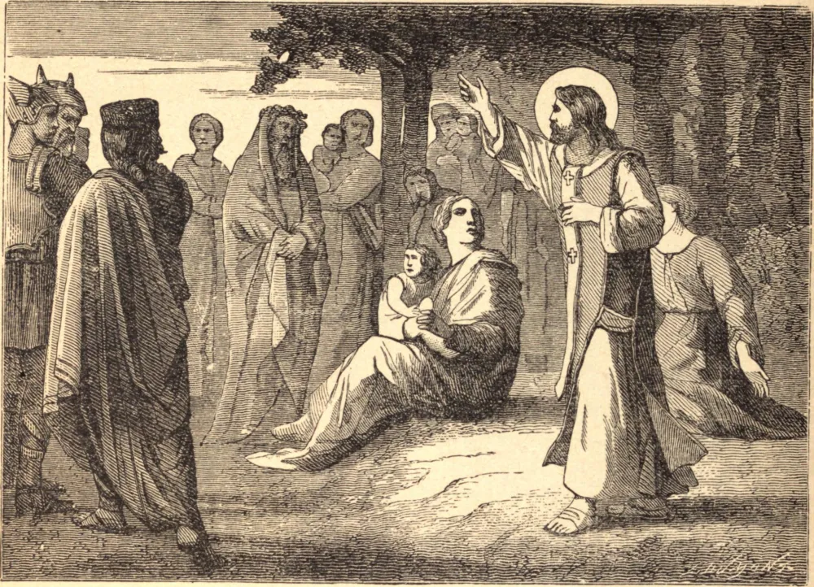

# December 18.—ST. GATIAN, Bishop

ST. GATIAN came from Rome with St. Dionysius of Paris, about the middle of the third century, and preached the Faith principally at Tours in Gaul, where he fixed his episcopal see. The Gauls in that part were extremely addicted to the worship of their idols. But no contradictions or sufferings were able to discourage or daunt this true apostle, and by perseverance he gained several to Christ.

He assembled his little flock in grots and caves, and there celebrated the divine mysteries. He was obliged often to lie hid in lurking holes a long time in order to escape a cruel death, with which the heathens frequently threatened him, and which he was always ready to receive with joy if he had fallen into their hands. Having continued his labors with unwearied zeal amidst frequent sufferings and dangers for near the space of fifty years, he died in peace, and was honored with miracles.

**Reflection**—God does not ask great sacrifices from all; but in His goodness He gives us all some things to renounce or to suffer for Him, and it is by our loving submission to His will that we show ourselves to be Christians.
