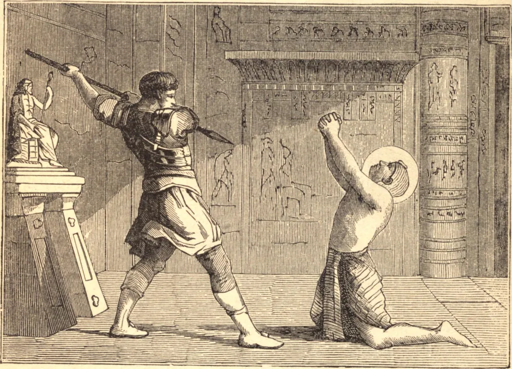

# December 22.—ST. ISCHYRION, Martyr

ISCHYRION was an inferior officer who attended on a magistrate of a certain city in Egypt. His master commanded him to offer sacrifice to the idols; and because he refused to commit that sacrilege, reproached him with the most abusive and threatening speeches. By giving way to passion and superstition, the officer at length worked himself up to such a degree of frenzy as to run a stake into the bowels of the meek servant of Christ, who, by his patient constancy, attained to the glory of martyrdom.

**Reflection**—It is not a man's condition, but virtue, that can make him truly great or truly happy. How mean soever a person's station or circumstances may be, the road to both is open to him; and there is not a servant or slave who ought not to be enkindled with a laudable ambition of arriving at this greatness, which will set him on the same level with the rich and the most powerful.
