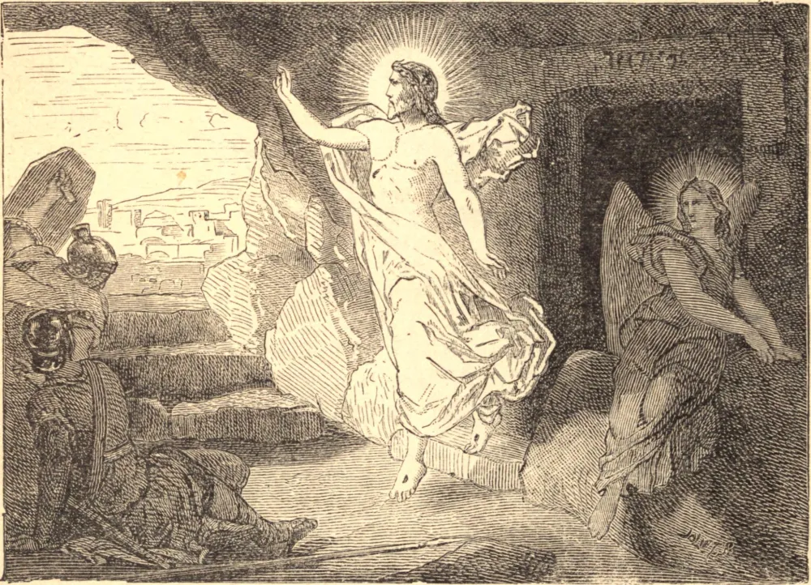

# Easter Sunday

The resurrection of the dead is one of the most consoling truths of Christianity. To die forever would be the most terrible of all destinies. The plant and the animal, unendowed with reason, die, never to live again; but they have not at least any apprehension as to what death is. To die is to them one of the thousand accidents bound up with life; to the plant it is as nothing, and for the animal without reason, a merely transitory pang, death itself being but the affair of a moment. For man, on the contrary, death has terrors which precede it, anguish accompanying it, and apprehensions consequent upon it. The most strongly-attempered spirit shudders on reflecting that it must incur death; the most selfish man has attachments which he with difficulty severs; the most determined unbeliever experiences doubts as to the shadowy To-morrow of death. Man would then be the most pitiable among all beings were Religion not at hand to say to him, "The grave is a place of momentary rest; you will come forth thence one day. The God that gave being to your limbs will restore it; the resurrection of Jesus Christ gives thereof an assured pledge."

This confidence in the future resurrection is a subject of the greatest joy to the children of God, the groundwork of their faith, the mainspring of their hope, and most lasting comfort amid the evils of this life. For if Christ had not risen, says the Apostle St. Paul, in vain should we believe in Him. He would be convicted of having been an impostor and His apostles of being mad; His death would not have availed us any thing, and we should still be dwelling in the bonds of sin. Those dying in Jesus Christ would perish, and our hope in Him not extending beyond the present life, we should be the most unfortunate of men, inasmuch as, after having had as our portion in this life, sufferings and afflictions, we should not be able to console ourselves with the expectation of future good. But Jesus Christ having come forth living from the tomb, His doctrine is confirmed by His resurrection; it establishes the certitude of His mission in His character as Son of God, the efficacy of the sacrifice He offered on the cross, the divinity of His priesthood, the rewards of the other life, and the glorified resurrection of the flesh.

## Reflection

We shall one day rise again; but let us range by the side of such a consoling expectation that terrible warning of the prophet Daniel, "Many of those that sleep in the dust of the earth shall awake, some unto life everlasting, and others unto reproach eternal."
