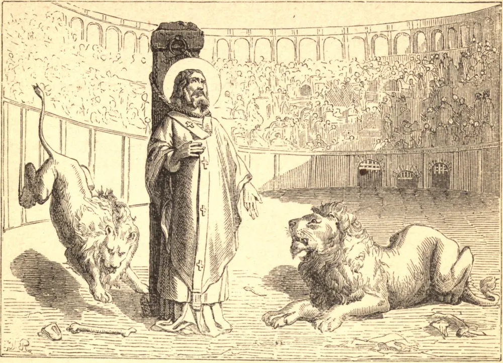

# ST. IGNATIUS, Bishop, Martyr

ST. IGNATIUS, Bishop of Antioch, was the disciple of St. John. When Domitian persecuted the Church, St. Ignatius obtained peace for his own flock by fasting and prayer. But for his part he desired to suffer with Christ, and to prove himself a perfect disciple. In the year 107, Trajan came to Antioch, and forced the Christians to choose between apostasy and death. "Who art thou, poor devil," the emperor said when Ignatius was brought before him, "who settest our commands at naught?" "Call not him 'poor devil,'" Ignatius answered, "who bears God within him." And when the emperor questioned him about his meaning, Ignatius explained that he bore in his heart Christ crucified for his sake. Thereupon the emperor condemned him to be torn to pieces by wild beasts at Rome. St. Ignatius thanked God, Who had so honored him, "binding him in the chains of Paul, His apostle."

He journeyed to Rome, guarded by soldiers, and with no fear except of losing the martyr's crown. He was devoured by lions in the Roman amphitheatre. The wild beasts left nothing of his body, except a few bones, which were reverently treasured at Antioch, until their removal to the Church of St. Clement at Rome, in 637. After the martyr's death, several Christians saw him in vision standing before Christ, and interceding for them.

**Reflection**—Ask St. Ignatius to obtain for you the grace of profiting by all you have to suffer, and rejoicing in it as a means of likeness to your crucified Redeemer.
