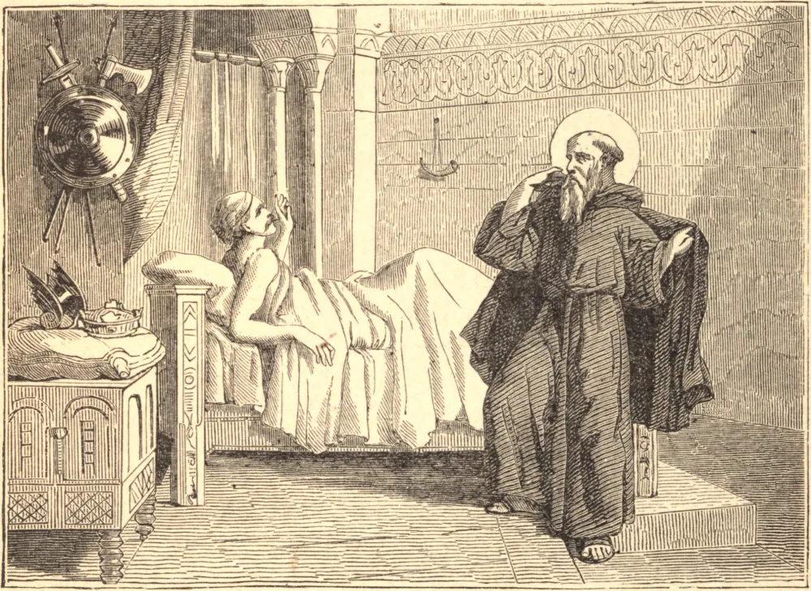

# February 11.—ST. SEVERINUS, Abbot of Agaunum

ST. SEVERINUS, of a noble family in Burgundy, was educated in the Catholic faith, at a time when the Arian heresy reigned in that country. He forsook the world in his youth, and dedicated himself to God in the monastery of Agaunum, which then only consisted of scattered cells, till the Catholic King Sigismund built there the great abbey of St. Maurice. St. Severinus was the holy abbot of that place, and had governed his community many years in the exercise of penance and charity, when, in 504, Clovis, the first Christian king of France, lying ill of a fever, which his physicians had for two years ineffectually endeavored to remove, sent his chamberlain to conduct the Saint to court; for it was said that the sick from all parts recovered their health by his prayers.

St. Severinus took leave of his monks, telling them he should never see them more in this world. On his journey he healed Eulalius, Bishop of Nevers, who had been for some time deaf and dumb; also a leper, at the gates of Paris; and coming to the palace he immediately restored the king to perfect health, by putting on him his own cloak. The king, in gratitude, distributed large alms to the poor and released all his prisoners.

St. Severinus, returning toward Agaunum, stopped at Château-Landon in Gatinois, where two priests served God in a solitary chapel, among whom he was admitted, at his request, as a stranger, and was soon greatly admired by them for his sanctity. He foresaw his death, which happened shortly after, in 507. The place is now an abbey of reformed canons regular of St. Austin. The Huguenots scattered the greater part of his relics when they plundered this church.

**Reflection**—God loads with His favor those who delight in exercising mercy. "According to thy ability be merciful: if thou hast much, give abundantly; if thou hast little, take care even so to bestow willingly a little."
