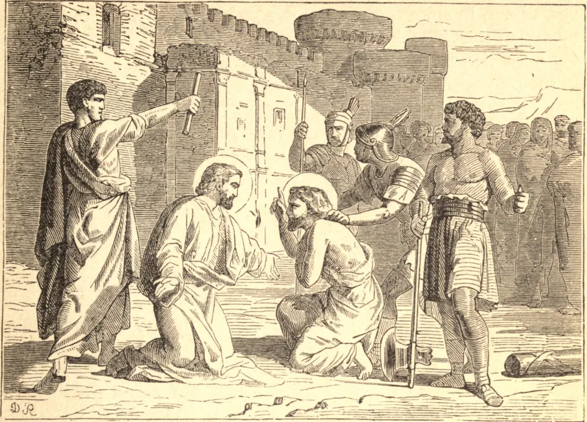

# February 15.—STS. FAUSTINUS and JOVITA, Martyrs

FAUSTINUS and Jovita were brothers, nobly born, and zealous professors of the Christian religion, which they preached without fear in their city of Brescia, while the bishop of that place lay concealed during the persecution. Their remarkable zeal excited the fury of the heathens against them, and procured them a glorious death for their faith at Brescia in Lombardy, under the Emperor Adrian. Julian, a heathen lord, apprehended them: and the emperor himself, passing through Brescia, when neither threats nor torments could shake their constancy, commanded them to be beheaded. They seem to have suffered about the year 121. The city of Brescia honors them as its chief patrons, possesses their relics, and a very ancient church in that city bears their names.

**Reflection**—The spirit of Christ is a spirit of martyrdom—at least of mortification and penance. It is always the spirit of the cross. The more we share in the suffering life of Christ, the greater share we inherit in His spirit, and in the fruit of His death. To souls mortified to their senses and disengaged from earthly things, God gives frequent foretastes of the sweetness of eternal life, and the most ardent desires of possessing Him in His glory. This is the spirit of martyrdom, which entitles a Christian to a happy resurrection and to the bliss of the life to come.
