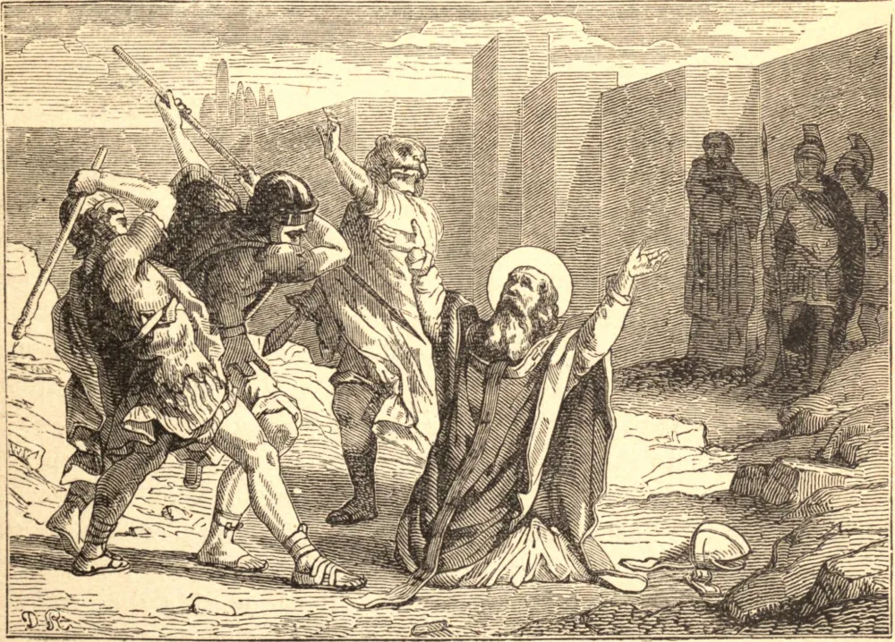

# February 21.—ST. SEVERIANUS, Martyr, Bishop

IN the reign of Marcian and St. Pulcheria, the Council of Chalcedon, which condemned the Eutychian heresy, was received by St. Euthymius and by a great part of the monks of Palestine. But Theodosius, an ignorant Eutychian monk, and a man of a most tyrannical temper, under the protection of the Empress Eudoxia, widow of Theodosius the Younger, who lived at Jerusalem, perverted many among the monks themselves, and having obliged Juvenal, Bishop of Jerusalem, to withdraw, unjustly possessed himself of that important see, and, in a cruel persecution which he raised, filled Jerusalem with blood; then, at the head of a band of soldiers, he carried desolation over the country. Many, however, had the courage to stand their ground. No one resisted him with greater zeal and resolution than Severianus, Bishop of Scythopolis, and his recompense was the crown of martyrdom; for the furious soldiers seized his person, dragged him out of the city, and massacred him, in the latter part of the year 452 or in the beginning of the year 453.

## Reflection

With what floods of tears can we sufficiently bewail so grievous a misfortune, and implore the divine mercy in behalf of so many souls! How ought we to be alarmed at the consideration of so many dreadful examples of God's inscrutable judgments, and tremble for ourselves! "Let him who stands beware lest he fall" "Hold fast what thou hast," says the oracle of the Holy Ghost to every one of us, "lest another bear away thy crown."
