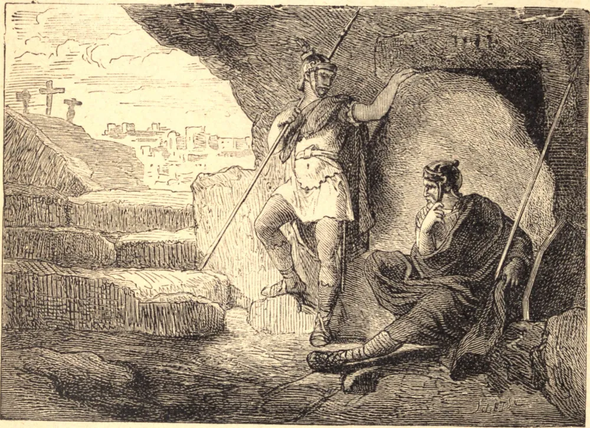

# Holy Saturday

Three hours after Jesus Christ had uttered His last sigh on the cross, two of His disciples, Nicodemus and Joseph of Arimathea, went to ask Pilate for the body, that they might give it burial. Having obtained it, they embalmed it according to the custom of the Jews, and deposited it not far from the place of Calvary, in a tomb hewn in the rock, wherein no one had yet been laid. Pilate caused the entrance to be sealed up, and placed a guard over it, lest the body should be taken away. The Saviour thus remained from nightfall on the Friday till the first rays of dawn on the Sunday. He had himself said that He was to pass this time in the tomb, and had quoted as an example the abiding of the prophet Jonas for the same space of time in the whale's belly. It was then a real death that was associated with these signs and precautions, and the sacrifice had been consummated and was irrevocable. Well might we then marvel at such excess of love, covering ourselves with confusion at the thought of how feebly we love Him who hath so greatly loved us, and of how little we do for Him who hath accomplished so much for us. But we would enter upon another consideration. With Jesus Christ died both the ancient world with its hideous worship; the synagogue with its symbols and mysteries; and the man of sin, the old Adam, with its concupiscences—yea, even death itself, which had been inflicted on man in punishment for sin. With Jesus Christ died sin, and sin was placed in the tomb with Him; for, according to the beautiful expression of the Apostle, the Saviour fastened the sins of men to the cross.

Now the cross itself was buried on the spot where Christ had suffered, as was the custom among the Jews, and as was fully shown by the finding thereof in conjunction with those of the two thieves, three centuries later, by St. Helen; whence it follows that among us Christians, the disciples, that is, of Christ, and regenerated by His death, there ought never to lurk any shadow of Jewish superstition or pagan morals, any remnant of the old Adam or man of sin. Concupiscences, disorderly passions, and love of the world should no longer exist but as the memory of a time that is no more.

## Reflection

"For we are buried together with Him by baptism unto death; that as Christ is risen from the dead by the glory of His Father, so we also may walk in newness of life. For if we have been planted together in the likeness of His death, we shall be also of His resurrection. Knowing this, that the old man is crucified with Him, that the body of sin may be destroyed, and that we may serve sin no longer."
