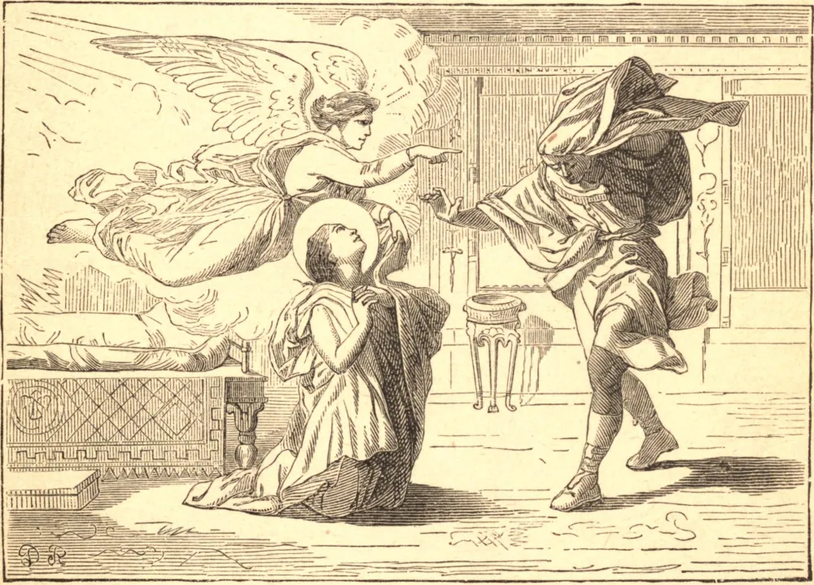

# January 21.—ST. AGNES, Virgin, Martyr

ST. AGNES was but twelve years old when she was led to the altar of Minerva at Rome and commanded to obey the persecuting laws of Diocletian by offering incense. In the midst of the idolatrous rites she raised her hands to Christ, her Spouse, and made the sign of the life-giving cross. She did not shrink when she was bound hand and foot, though the gyves slipped from her young hands, and the heathens who stood around were moved to tears. The bonds were not needed for her, and she hastened gladly to the place of her torture.

Next, when the judge saw that pain had no terrors for her, he inflicted an insult worse than death: her clothes were stripped off, and she had to stand in the street before a pagan crowd; yet even this did not daunt her. "Christ," she said, "will guard His own." So it was. Christ showed, by a miracle, the value which He sets upon the custody of the eyes. Whilst the crowd turned away their eyes from the spouse of Christ, as she stood exposed to view in the street, there was one young man who dared to gaze at the innocent child with immodest eyes. A flash of light struck him blind, and his companions bore him away half dead with pain and terror.

Lastly, her fidelity to Christ was proved by flattery and offers of marriage. But she answered, "Christ is my Spouse: He chose me first, and His I will be." At length the sentence of death was passed. For a moment she stood erect in prayer, and then bowed her neck to the sword. At one stroke her head was severed from her body, and the angels bore her pure soul to Paradise.

**Reflection**—Her innocence endeared St. Agnes to Christ, as it has endeared her to His Church ever since. Even as penitents we may imitate this innocence of hers in our own degree. Let us strictly guard our eyes, and Christ, when He sees that we keep our hearts pure for love of Him, will renew our youth and give us back the years which the canker-worm has wasted.
