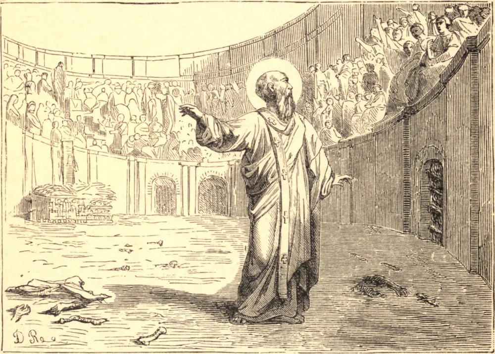

# January 26.—ST. POLYCARP, Bishop, Martyr

ST. POLYCARP, Bishop of Smyrna, was a disciple of St. John. He wrote to the Philippians, exhorting them to mutual love and to hatred of heresy. When the apostate Marcion met St. Polycarp at Rome, he asked the aged Saint if he knew him. "Yes," St. Polycarp answered, "I know you for the first-born of Satan." These were the words of a Saint most loving and most charitable, and specially noted for his compassion to sinners. He hated heresy, because he loved God and man so much.

In 167, persecution broke out in Smyrna. When Polycarp heard that his pursuers were at the door, he said, "The will of God be done; " and meeting them, he begged to be left alone for a little time, which he spent in prayer for "the Catholic Church throughout the world." He was brought to Smyrna early on Holy Saturday; and, as he entered, a voice was heard from heaven, "Polycarp, be strong." When the proconsul besought him to curse Christ and go free, Polycarp answered, "Eighty-six years I have served Him, and He never did me wrong; how can I blaspheme my King and Saviour?" When he threatened him with fire, Polycarp told him this fire of his lasted but a little, while the fire prepared for the wicked lasted forever. At the stake he thanked God aloud for letting him drink of Christ's chalice. The fire was lighted, but it did him no hurt; so he was stabbed to the heart, and his dead body was burnt. "Then," say the writers of his acts, "we took up the bones, more precious than the richest jewels or gold, and deposited them in a fitting place, at which may God grant us to assemble with joy to celebrate the birthday of the martyr to his life in heaven!"

**Reflection**—If we love Jesus Christ, we shall love the Church and hate heresy, which rends His mystical body, and destroys the souls for which He died. Like St. Polycarp, we shall maintain our constancy in the faith by loves of Jesus Christ, Who is its author and its finisher.
