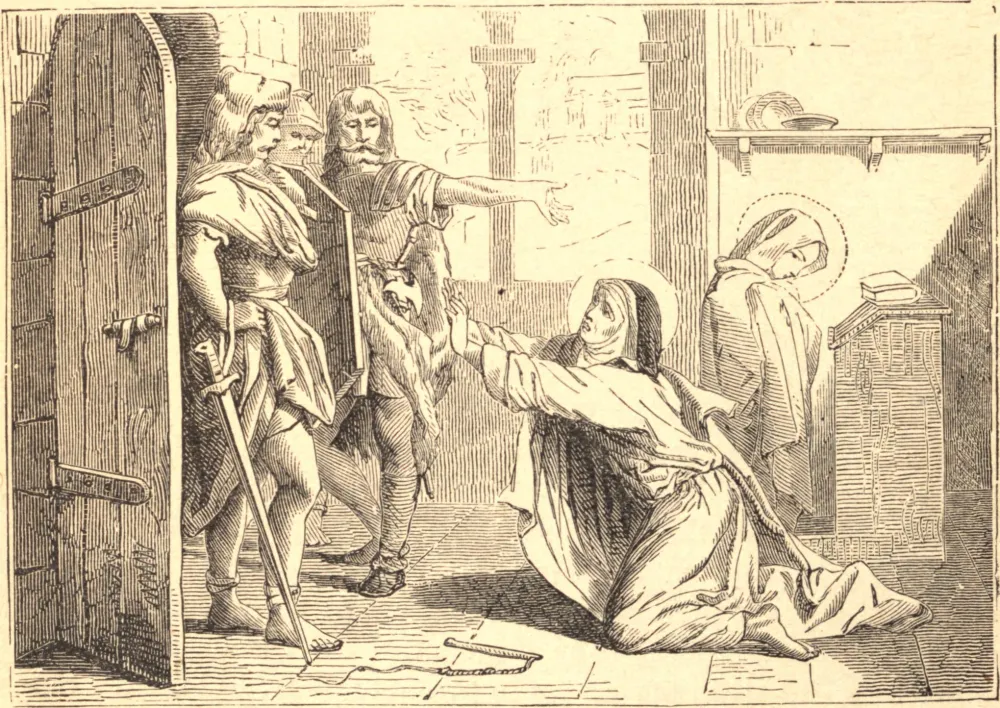

# January 31.—ST. MARCELLA, Widow

ST. MARCELLA, whom St. Jerome called the glory of the Roman women, became a widow in the seventh month after her marriage. Having determined to consecrate the remainder of her days to the service of God, she rejected the hand of Cerealis, the consul, uncle of Gallus Caesar, and resolved to imitate the lives of the ascetics of the East. She abstained from wine and flesh-meat, employed all her time in pious reading, prayer, and visiting the churches, and never spoke with any man alone. Her example was followed by many who put themselves under her direction, and Rome was in a short time filled with monasteries. When the Goths under Alaric plundered Rome in 410, our Saint suffered severely at the hands of the barbarian, who cruelly scourged her in order to make her reveal the treasures which she had long before distributed in charity. She trembled only, however, for the innocence of her dear spiritual daughter, Principia, and falling at the feet of the cruel soldiers, she begged with many tears that they would offer no insult to that pure virgin. God moved them to compassion, and they conducted our Saint and her pupil to the Church of St. Paul, to which Alaric had granted the right of sanctuary, with that of St. Peter. St. Marcella, who survived this but a short time, closed her eyes by a happy death, in the arms of St. Principia, about the end of August, 410.
