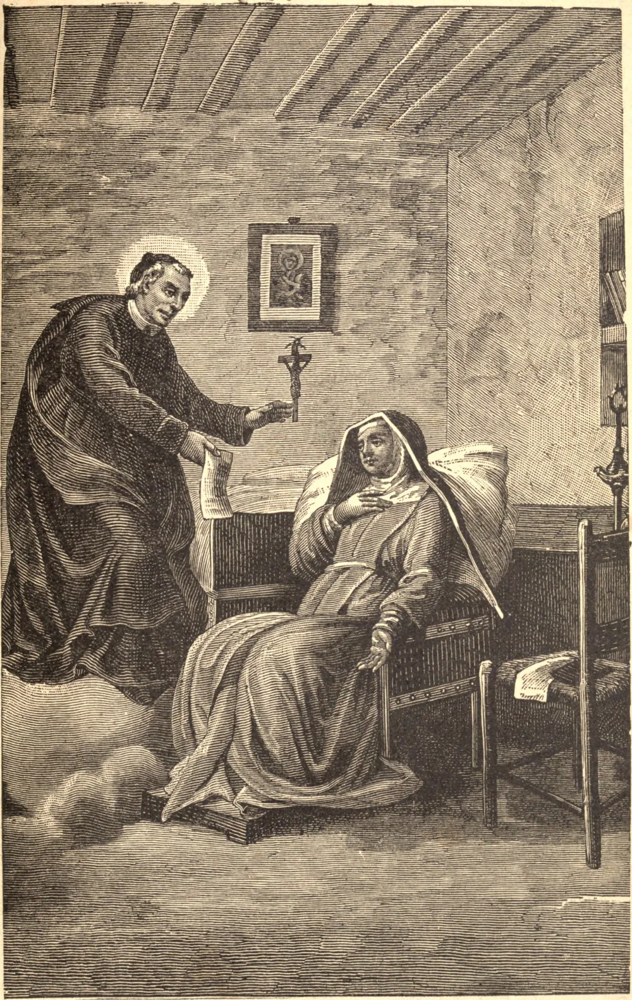

# St. John Baptist de Rossi

John Baptist de Rossi is the first instance in modern times of the canonization as Confessor of a priest belonging to no religious Order or Congregation. He was born at Voltaggio, a little town about fifteen miles from Genoa, February 22, 1698. From the first he was distinguished for his piety and purity. The parish church was his favorite resort, and thither he would hasten after the early morning class to serve as many Masses as he could. The gravity and modesty he showed in holy places struck all who saw him, and many declared he was like a little angel just come down from heaven, full of the vision of God.

When our Saint was ten years old, a wealthy couple visited Voltaggio; attracted by the unaffected piety and wit of the boy, they obtained from his parents permission to take him, and took him to their palace, where he was treated as their son. After a residence of three years in Genoa, he removed, with his mother's consent, — his father having died in the meanwhile, — to Rome, where his cousin, Laurence de Rossi, was the Canon of S. Maria in Cosmedin. There he began at once to attend the lower classes of the Roman College, and there was no more industrious or saintly student to be found. At the age of eighteen he received the tonsure, and the following year minor orders. He was then selected for a lengthened course of scholastic theology; but in striving to purify his soul he overtaxed his strength, and one day, while devoutly hearing Mass, he fell on the floor of the church in a swoon. From that time out he was subject to epileptic fits, which rendered his projected studies impracticable. This being the case, our Saint looked elsewhere. A course of lectures on the text of St. Thomas, then being delivered, was attracting no little attention, and a large number of students attended. As the labor of following the course was comparatively light, John Baptist joined the class. In spite of his feeble health he applied himself most industriously, and still practised such mortifications as were prudent. Walking along the streets, his eyes were never raised from the ground, and in the coldest weather he wore no gloves.

When he was twenty-three years old he was ordained a priest. The first shape his charity assumed was an active interest in the young students who flock to Rome from every part of the Catholic world. He organized special services for them, preached sermons specially suited to them, and gathered them about him in his visits to the hospitals, to assist him in soothing and relieving the sick and dying. This charitable work over, they would enter a church and recite the Rosary aloud, after which they would enjoy themselves at some innocent game. Another charity which attracted our Saint was the spiritual care of the drovers and cattlemen who frequented the market places. The most of these were ignorant and depraved, caring for no one and with no one to care for them. By visiting their haunts at early dawn, before their work began, John Baptist won them by his kind words, and at last led many to the confessional who had not been there in years, and some who had never been. Hitherto he had not heard confessions himself, but now, at the instance of his bishop, he applied for and received faculties for the administration of the Sacrament of Penance.

In February, 1735, John Baptist, much against his own inclination, was appointed assistant to his cousin, Laurence de Rossi, who was growing feeble; and when, two years after, that good man died, his property and canonry were left to our Saint. Within a fortnight the new Canon of Santa Maria in Cosmedin had got rid of a great part of the property. He entered upon the duties of his new office at once, and soon gathered round him crowds of devout worshippers. His confessional was besieged by eager penitents, but always the poorest and most ignorant. The rich and noble he managed to put off, saying they could find confessors in plenty. He would never permit the confessional to be a medium for alms-giving. He himself would not bestow an alms from that tribunal on a penitent, no matter how poor, nor would he there accept a present from the rich, as he feared it might deter him from speaking plainly and freely. His devotion to the poor and ignorant was remarkable. He sought out the most abject and abandoned people, and pursued this work of Christian charity with such zeal as to merit the title of "Venator Animarum," the hunter of souls.

In 1740, when Pope Benedict XIV. determined to institute catechism classes for the instruction of criminals serving short sentences, he found an able assistant in our Saint. He had no difficulty in winning the hearts of the convicts from the start, and there was a perceptible reformation wrought in a short time. The endless labor and the severe penances which the Saint imposed on himself finally told on his delicate frame, and on May 23, 1764, a stroke of apoplexy ended his mortal life, and brought him the endless bliss of the presence of God, for which his soul had so long yearned.

After the death of the holy man many miracles bore witness to his sanctity. Among others was the case of Sister Mary Theresa Leonori, of the Convent of St. Cecilia at Rome, who in 1859 suffered from a throat disease which the best medical authorities pronounced incurable. Wasted and enfeebled by her sickness, entirely deprived of speech, suffering great pain, and unable to partake of any nourishment, her death was momentarily looked for. Human aid failing her, the pious Sister besought the help of St. John Baptist, and Our Lord, to show His love for His faithful servant, deigned to work a miracle at the Saint's intercession. Sister Mary Theresa was instantly cured and rose from her bed of suffering a well woman.
