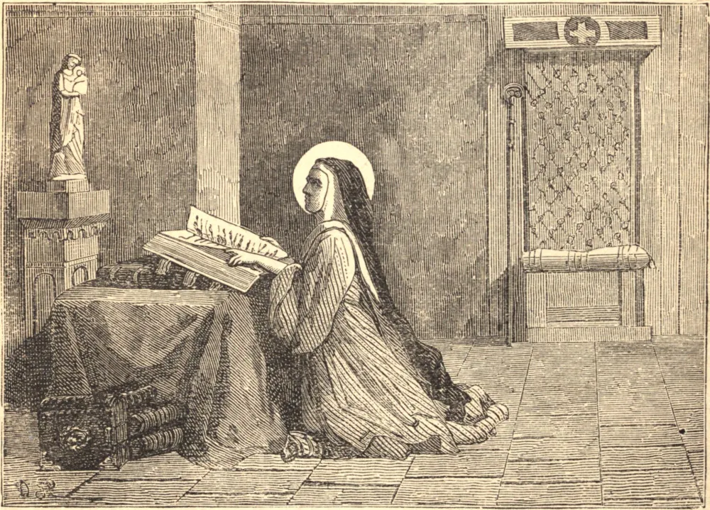

# July 4.—ST. BERTHA, Widow, Abbess

BERTHA was the daughter of Count Rigobert and Umana, related to one of the kings of Kent in England. In the twentieth year of her age she was married to Sigefroi, by whom she had five daughters, two of whom, Gertrude and Deotila, are Saints. After her husband's death she put on the veil in the nunnery which she had built at Blangy in Artois, a little distance from Hesdin. Her daughters Gertrude and Deotila followed her example.

She was persecuted by Roger, or Rotgar, who endeavored to asperse her with King Thierri III., to revenge his being refused Gertrude in marriage. But this prince, convinced of the innocence of Bertha, then abbess over her nunnery, gave her a kind reception and took her under his protection.

On her return to Blangy, Bertha finished her nunnery and caused three churches to be built, one in honor of St. Omer, another she called after St. Vaast, and the third in honor of St. Martin of Tours. And then, after establishing a regular observance in her community, she left St. Deotila abbess in her stead, and shut herself in a cell, to pass the remainder of her days in prayer. She died about the year 725. A great part of her relics are kept at Blangy.
