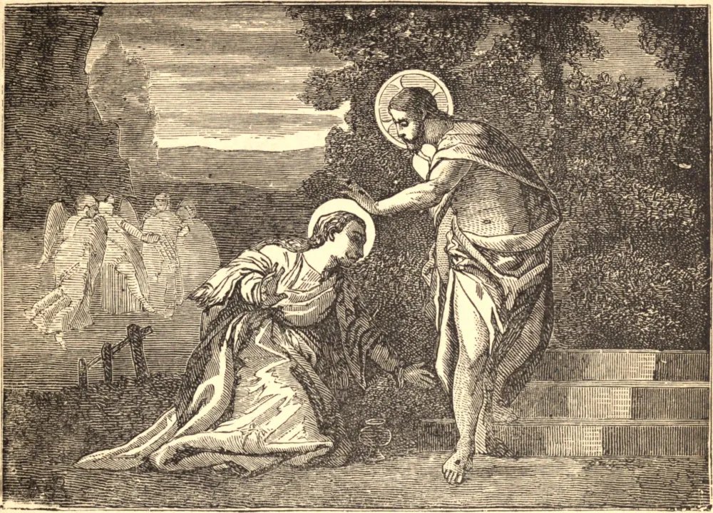

# July 22.—ST. MARY MAGDALEN

Of the earlier life of Mary Magdalen we know only that she was "a woman who was a sinner." From the depth of her degradation she raised her eyes to Jesus with sorrow, hope, and love. All covered with shame, she came in where Jesus was at meat, and knelt behind him. She said not a word, but bathed His feet with her tears, wiped them with the hair of her head, kissed them in humility, and at their touch her sins and her stain were gone. Then she poured on them the costly unguent prepared for far other uses; and His own divine lips rolled away her reproach, spoke her absolution, and bade her go in peace. Thenceforward she ministered to Jesus, sat at His feet, and heard His words. She was one of the family "whom Jesus so loved" that He raised her brother Lazarus from the dead. Once again, on the eve of His Passion, she brought the precious ointment, and, now purified and beloved, poured it on His head, and the whole house of God is still filled with the fragrance of her anointing. She stood with Our Lady and St. John at the foot of the cross, the representative of the many who have had much forgiven. To her first, after His blessed Mother, and through her to His apostles, Our Lord gave the certainty of His resurrection; and to her first He made Himself known, calling her by her name, because she was His. When the faithful were scattered by persecution the family of Bethany found refuge in Provence. The cave in which St. Mary lived for thirty years is still seen, and the chapel on the mountaintop, in which she was caught up daily, like St. Paul, to "visions and revelations of the Lord." When her end drew near she was borne to a spot still marked by a "sacred pillar," where the holy Bishop Maximin awaited her; and when she had received her Lord, she peacefully fell asleep in death.

## Reflection

"Compunction of heart," says St. Bernard, "is a treasure infinitely to be desired, and an unspeakable gladness to the heart. It is healing to the soul; it is remission of sins; it brings back again the Holy Spirit into the humble and loving heart."
