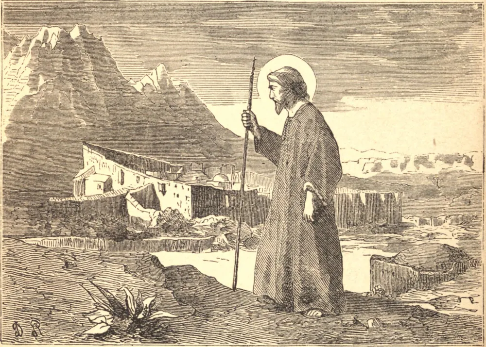

# June 14.—ST. BASIL THE GREAT

ST. BASIL was born in Asia Minor. Two of his brothers became bishops, and, together with his mother and sister, are honored as Saints. He studied with great success at Athens, where he formed with St. Gregory Nazianzen the most tender friendship. He then taught oratory; but dreading the honors of the world, he gave up all, and became the father of the monastic life in the East.

The Arian heretics, supported by the court, were then persecuting the Church; and Basil was summoned from his retirement by his bishop to give aid against them. His energy and zeal soon mitigated the disorders of the Church, and his solid and eloquent words silenced the heretics. On the death of Eusebius, he was chosen Bishop of Cæsarea. His commanding character, his firmness and energy, his learning and eloquence, and not less his humility and the exceeding austerity of his life, made him a model for bishops.

When St. Basil was required to admit the Arians to Communion, the prefect, finding that soft words had no effect, said to him, "Are you mad, that you resist the will before which the whole world bows? Do you not dread the wrath of the emperor, nor exile, nor death?" "No," said Basil calmly; "he who has nothing to lose need not dread loss of goods; you cannot exile me, for the whole earth is my home; as for death, it would be the greatest kindness you could bestow upon me; torments cannot harm me: one blow would end my frail life and my sufferings together." "Never," said the prefect, "has any one dared to address me thus." "Perhaps," suggested Basil, "you never before measured your strength with a Christian bishop." The emperor desisted from his commands.

St. Basil's whole life was one of suffering. He lived amid jealousies and misunderstandings and seeming disappointments. But he sowed the seed which bore goodly fruit in the next generation, and was God's instrument in beating back the Arian and other heretics in the East, and restoring the spirit of discipline and fervor in the Church. He died in 379, and is venerated as a Doctor of the Church.

**Reflection**—"Fear God," says the *Imitation of Christ*, "and thou shalt have no need of being afraid of any man."
