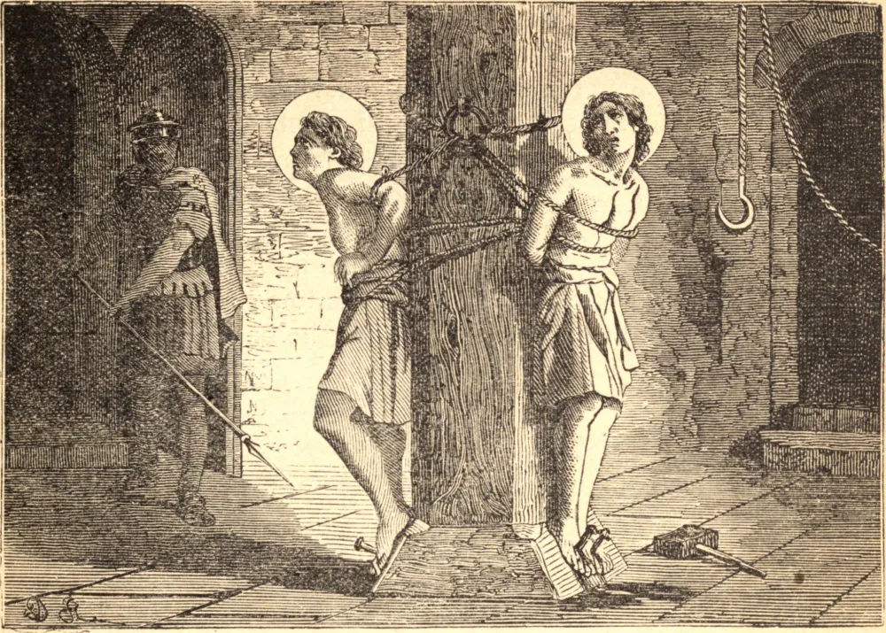

# June 18.—STS. MARCUS and MARCELLIANUS, Martyrs

MARCUS AND MARCELLIANUS were twin brothers of an illustrious family in Rome, who had been converted to the Faith in their youth and were honorably married. Diocletian ascending the imperial throne in 284, the heathens raised persecutions. These martyrs were thrown into prison, and condemned to be beheaded. Their friends obtained a respite of the execution for thirty days, that they might prevail on them to worship the false gods, Tranquillinus and Martia, their afflicted heathen parents, in company with their sons' own wives and their little babes, endeavored to move them by the most tender entreaties and tears. St. Sebastian, an officer of the emperor's household, coming to Rome soon after their commitment, daily visited and encouraged them. The issue of the conferences was the happy conversion of the father, mother, and wives, also of Nicostratus, the public register, and soon after of Chromatius, the judge, who set the Saints at liberty, and, abdicating the magistracy, retired into the country. Marcus and Marcellianus were hid by a Christian officer of the household in his apartments in the palace; but they were betrayed by an apostate, and retaken. Fabian, who had succeeded Chromatius, condemned them to be bound to two pillars, with their feet nailed to the same. In this posture they remained a day and a night, and on the following day were stabbed with lances.

## Reflection

We know not what we are till we have been tried. It costs nothing to say we love God above all things, and to show the courage of martyrs at a distance from the danger; but that love is sincere which has stood the proof. "Persecution shows who is a hireling, and who a true pastor," says St. Bernard.
