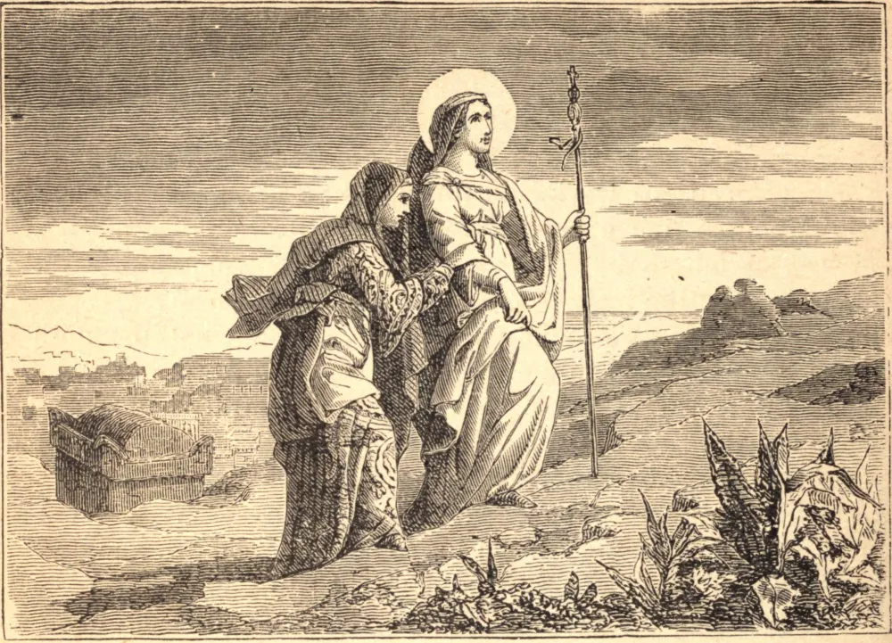

# March 22.—ST. CATHARINE OF SWEDEN, Virgin

ST. CATHARINE was daughter of Ulpho, Prince of Nericia in Sweden, and of St. Bridget. The love of God seemed almost to prevent in her the use of her reason. At seven years of age she was placed in the nunnery of Risburgh, and educated in piety under the care of the holy abbess of that house. Being very beautiful, she was, by her father, contracted in marriage to Egard, a young nobleman of great virtue; but the virgin persuaded him to join with her in making a mutual vow of perpetual chastity. By her discourse he became desirous only of heavenly graces, and, to draw them down upon his soul more abundantly, he readily acquiesced in the proposal. The happy couple, having but one heart and one desire, by a holy emulation excited each other to prayer, mortification, and works of charity.

After the death of her father, St. Catharine, out of devotion to the Passion of Christ and to the relics of the martyrs, accompanied her mother in her pilgrimages and practices of devotion and penance. After her mother's death at Rome, in 1373, Catharine returned to Sweden, and died abbess of Vadzstena, or Vatzen, on the 24th of March in 1381. For the last twenty-five years of her life she every day purified her soul by a sacramental confession of her sins.

**Reflection**—Whoever has to dwell in the world stands in need of great prudence; the Holy Scripture itself assures us that "the knowledge of the holy is prudence."
