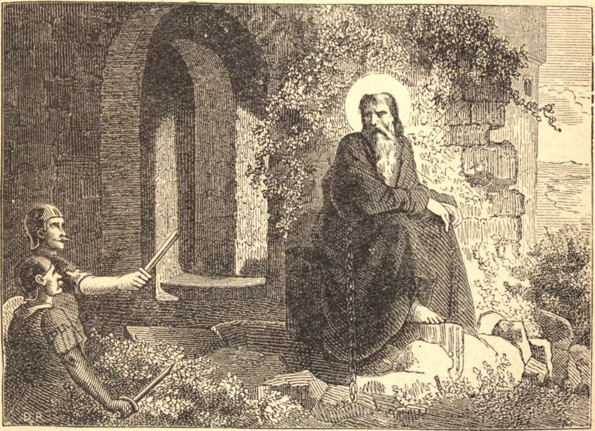

# May 21.—ST. HOSPITIUS, Recluse

ST. HOSPITIUS shut himself up in the ruins of an old tower near Villafranca, one league from Nice in Provence. He girded himself with a heavy iron chain and lived on bread and dates only. During Lent he redoubled his austerities, and, in order to conform his life more closely to that of the anchorites of Egypt, ate nothing but roots. For his great virtues Heaven honored him with the gifts of prophecy and of miracles. He foretold the ravages which the Lombards would make in Gaul. These barbarians, having come to the tower in which Hospitius lived, and seeing the chain with which he was bound, mistook him for some criminal who was there imprisoned. On questioning the Saint, he acknowledged that he was a great sinner and unworthy to live. Whereupon one of the soldiers lifted his sword to strike him; but God did not desert His faithful servant: the soldier's arm stiffened and became numb, and it was not until Hospitius made the sign of the cross over it that the man recovered the use of it. The soldier embraced Christianity, renounced the world, and passed the rest of his days in serving God. When our Saint felt that his last hour was nearing, he took off his chain and knelt in prayer for a long time. Then, stretching himself on a little bank of earth, he calmly gave up his soul to God, on the 21st of May, 681.

## Reflection

If we do not love penitence for its own sake, let us love it on account of our sins; for we should "work out our salvation in fear and trembling."
