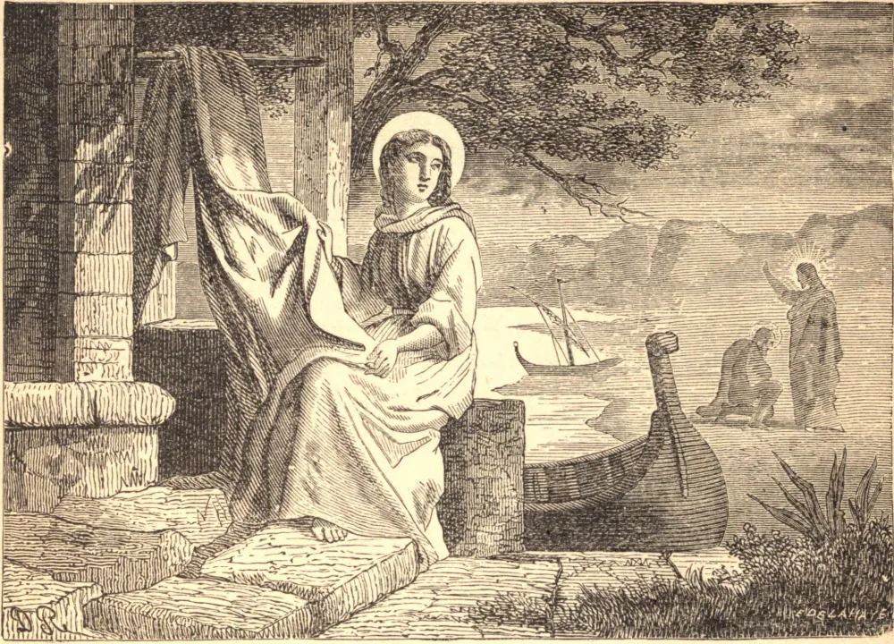

# May 31.—ST. PETRONILLA, Virgin

AMONG the disciples of the apostles in the primitive age of saints this holy virgin shone as a bright star in the Church. She lived when Christians were more solicitous to live well than to write much: they knew how to die for Christ, but did not compile long books in which vanity has often a greater share than charity. Hence no particular account of her actions has been handed down to us. But how eminent her sanctity was we may judge from the lustre by which it was distinguished among apostles, prophets, and martyrs.

She is said to have been a daughter of the apostle St. Peter; that St. Peter was married before his vocation to the apostleship we learn from the Gospel. St. Clement of Alexandria assures us that his wife attained to the glory of martyrdom, at which Peter himself encouraged her, bidding her to remember Our Lord. But it seems not certain whether St. Petronilla was more than the spiritual daughter of that apostle. She flourished at Rome, and was buried on the way to Ardea, where in ancient times a cemetery and a church bore her name.

**Reflection**—With the saints the great end for which they lived was always present to their minds, and they thought every moment lost in which they did not make some advances toward eternal bliss. How will their example condemn at the last day the trifling fooleries and the greatest part of the conversation and employments of the world, which aim at nothing but present amusements, and forget the only important affair—the business of eternity.
