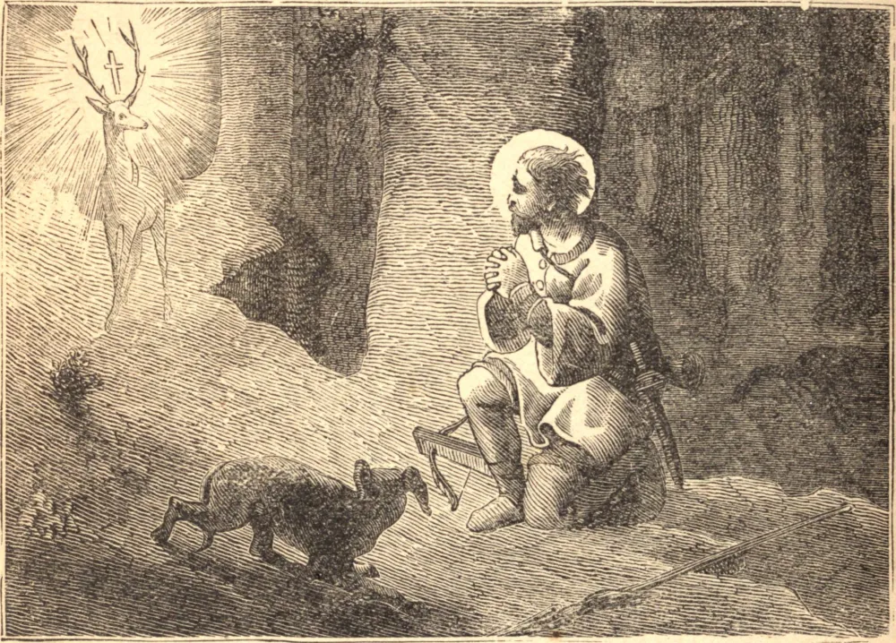

# November 3.—ST. HUBERT, Bishop

ST. HUBERT'S early life is so obscured by popular traditions that we have no authentic account of his actions. He is said to have been passionately addicted to hunting, and was entirely taken up in worldly pursuits. One thing is certain: that he is the patron saint of hunters. Moved by divine grace, he resolved to renounce the world. His extraordinary fervor, and the great progress which he made in virtue and learning, strongly recommended him to St. Lambert, Bishop of Maestricht, who ordained him priest, and entrusted him with the principal share in the administration of his diocese. That holy prelate being barbarously murdered in 681, St. Hubert was unanimously chosen his successor. With incredible zeal he penetrated into the most remote and barbarous places of Ardenne, and abolished the worship of idols; and, as he performed the office of the apostles, God bestowed on him a like gift of miracles. He died on the 30th of May, in 727, reciting to his last breath the Creed and the Lord's Prayer.

## Reflection

What the Wise Man has said of Wisdom may be applied to Grace: "That it ordereth the means with gentleness, and attaineth its end with power."
