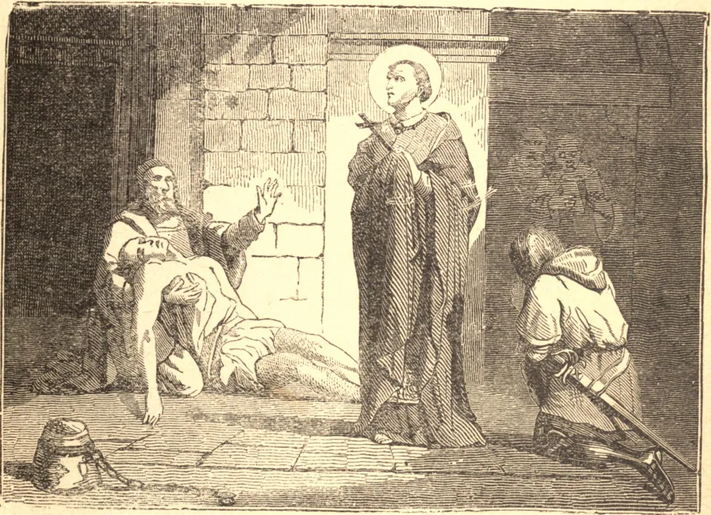

# November 4.—ST. CHARLES BORROMEO

ABOUT fifty years after the Protestant heresy had broken out, Our Lord raised up a mere youth to renew the face of His Church. In 1560 Charles Borromeo, then twenty-two years of age, was created cardinal, and by the side of his uncle, Pius IV., administered the affairs of the Holy See. His first care was the direction of the Council of Trent. He urged forward its sessions, guided its deliberations by continual correspondence from Rome, and by his firmness carried it to its conclusion. Then he entered upon a still more arduous work—the execution of its decrees. As Archbishop of Milan he enforced their observance, and thoroughly restored the discipline of his see. He founded schools for the poor, seminaries for the clerics, and by his community of Oblates trained his priests to perfection. Inflexible in maintaining discipline, to his flock he was a most tender father. He would sit by the roadside to teach a poor man the Pater and Ave, and would enter hovels the stench of which drove his attendants from the door. During the great plague he refused to leave Milan, and was ever by the sick and dying, and sold even his bed for their support. So he lived and so he died, a faithful image of the Good Shepherd, up to his last hour giving his life for his sheep.

## Reflection

Daily resolutions to fulfil, at all cost, every duty demanded by God, is the lesson taught by St. Charles; and a lesson we must learn if we would overcome our corrupt nature and reform our lives.
