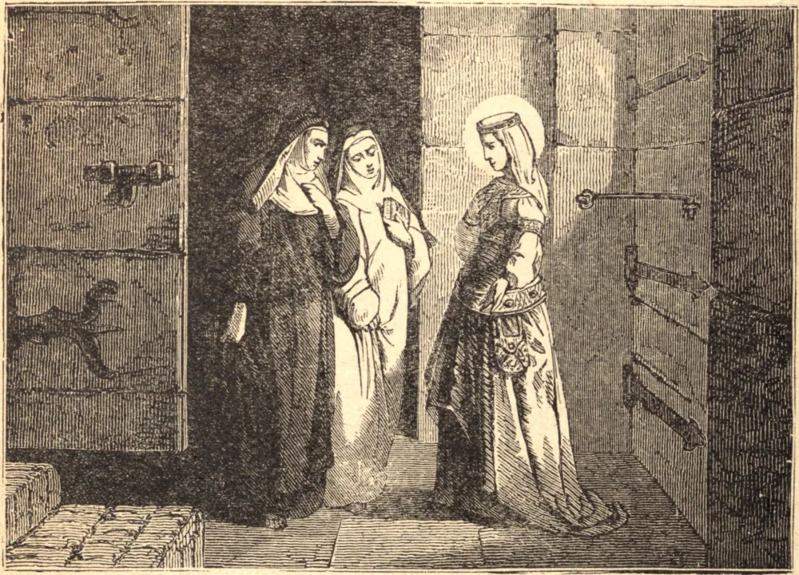

# November 5.—ST. BERTILLE, Abbess

ST. BERTILLE was born of one of the most illustrious families in the territory of Soissons, in the reign of Dagobert I. As she grew up she learned perfectly to despise the world, and earnestly desired to renounce it. Not daring to tell this to her parents, she first consulted St. Ouen, by whom she was encouraged in her resolution. The Saint's parents were then made acquainted with her desire, which God inclined them not to oppose. They conducted her to Jouarre, a great monastery in Brie, four leagues from Meaux, where she was received with great joy and trained up in the strictest practice of monastic perfection. By her perfect submission to all her sisters she seemed every one's servant, and acquitted herself with such great charity and edification that she was chosen prioress to assist the abbess in her administration. About the year 646 she was appointed first abbess of the abbey of Chelles, which she governed for forty-six years with equal vigor and discretion, until she closed her penitential life in 692.

## Reflection

It is written that the Saints raise themselves heavenward, going from virtue to virtue, as by steps.
