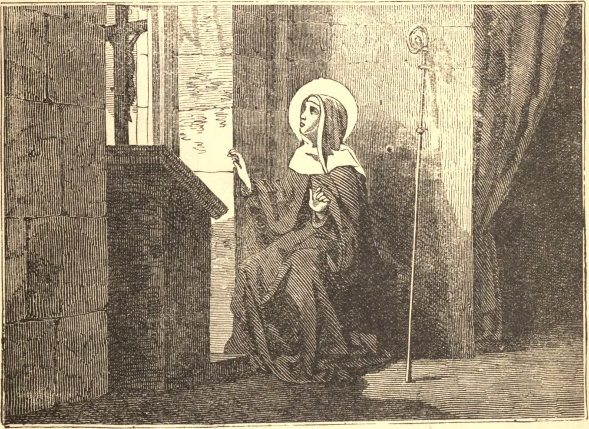

# November 15.—ST. GERTRUDE, Abbess

GERTRUDE was born in the year 1263, of a noble Saxon family, and placed at the age of five for education in the Benedictine abbey of Rodelsdorf. Her strong mind was carefully cultivated, and she wrote Latin with unusual elegance and force; above all, she was perfect in humility and mortification, in obedience, and in all monastic observances.

Her life was crowded with wonders. She has in obedience recorded some of her visions, in which she traces in words of indescribable beauty the intimate converse of her soul with Jesus and Mary. She was gentle to all, most gentle to sinners; filled with devotion to the Saints of God, to the souls in purgatory, and above all to the Passion of Our Lord and to His Sacred Heart.

She ruled her abbey with perfect wisdom and love for forty years. Her life was one of great and almost continual suffering, and her longing to be with Jesus was not granted till 1334, when she had reached her seventy-second year.

**Reflection**—No preparation for death can be better than to offer and resign ourselves anew to the Divine Will—humbly, lovingly, with unbounded confidence in the infinite mercy and goodness of God.
