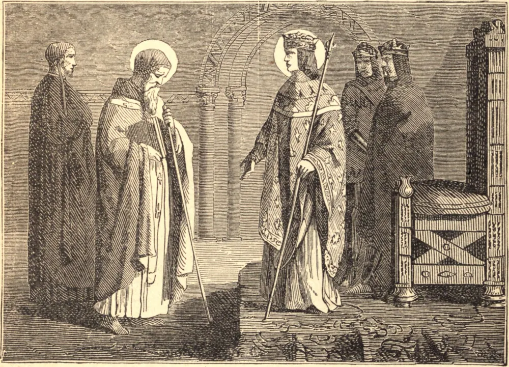

# November 16.—ST. EDMUND OF CANTERBURY

ST. EDMUND left his home at Abingdon, a boy of twelve years old, to study at Oxford, and there protected himself against many grievous temptations by a vow of chastity, and by espousing himself to Mary for life.

He was soon called to active public life, and as treasurer of the diocese of Salisbury showed such charity to the poor that the dean said he was rather the treasure than the treasurer of their church. In 1234 he was raised to the see of Canterbury, where he fearlessly defended the rights of Church and State against the avarice and greed of Henry III.; but finding himself unable to force that monarch to relinquish the livings which he kept vacant for the benefit of the royal coffers, Edmund retired into exile sooner than appear to connive at so foul a wrong.

After two years spent in solitude and prayer, he went to his reward, and the miracles wrought at his tomb at Pontigny were so numerous that he was canonized in 1246, within four years of his death.

**Reflection**—The Saints were tempted even more than ourselves; but they stood where we fall, because they trusted to Mary, and not to themselves.
