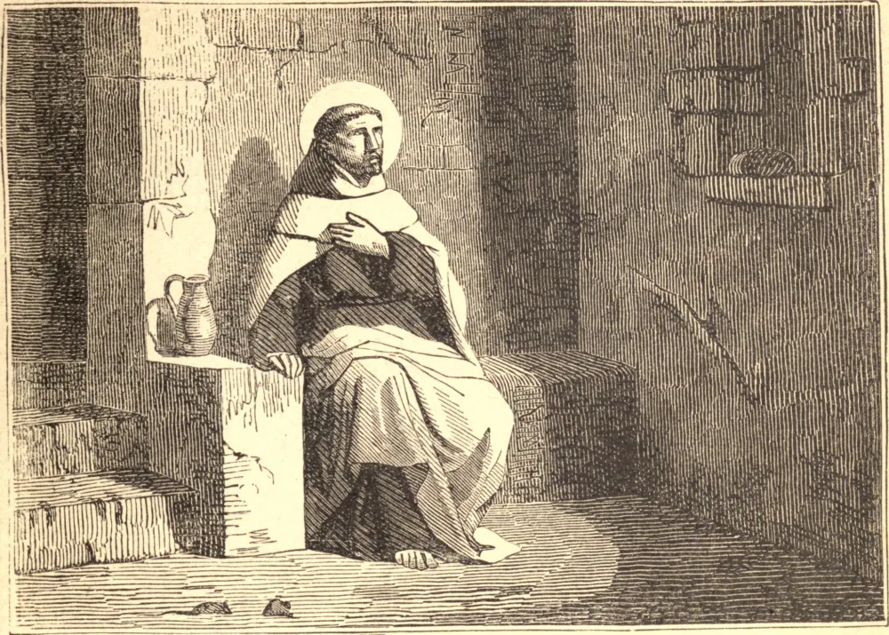

# November 24.—ST. JOHN OF THE CROSS

THE father of St. John was discarded by his kindred for marrying a poor orphan, and the Saint, thus born and nurtured in poverty, chose it also for his portion. Unable to learn a trade, he became the servant of the poor in the hospital of Medina, while still pursuing his sacred studies.

In 1563, being then twenty-one, he humbly offered himself as a lay-brother to the Carmelite friars, who, however, knowing his talents, had him ordained priest. He would now have exchanged to the severe Carthusian Order, had not St. Teresa, with the instinct of a Saint, persuaded him to remain and help her in the reform of his own Order. Thus he became the first prior of the Barefooted Carmelites.

His reform, though approved by the general, was rejected by the elder friars, who condemned the Saint as a fugitive and apostate, and cast him into prison, whence he only escaped, after nine months' suffering, at the risk of his life. Twice again, before his death, he was shamefully persecuted by his brethren, and publicly disgraced. But his complete abandonment by creatures only deepened his interior peace and devout longing for heaven.

**Reflection**—"Live in the world," said St. John, "as if God and your soul only were in it; so shall your heart be never made captive by any earthly thing."
