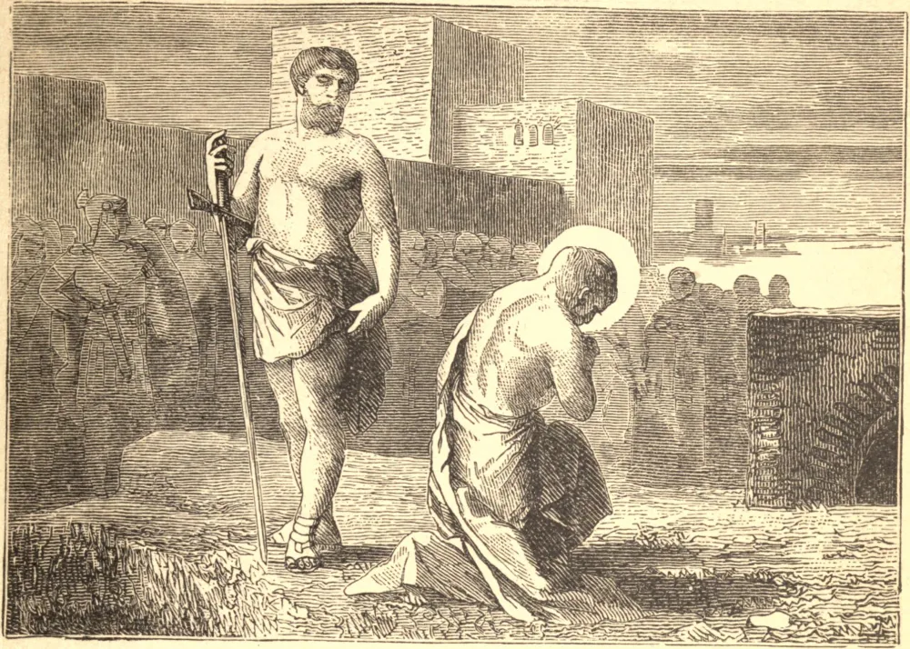

# November 26.—ST. PETER OF ALEXANDRIA, Bishop, Martyr

ST. PETER governed the Church of Alexandria during the persecution of Diocletian. The sentence of excommunication that he was the first to pronounce against the schismatics, Melitius and Arius, and which, despite the united efforts of powerful partisans, he strenuously upheld, proves that he possessed as much sagacity as zeal and firmness. But his most constant care was employed in guarding his flocks from the dangers arising out of persecution. He never ceased repeating to them that, in order not to fear death, it was needful to begin by dying to self, renouncing our will, and detaching ourselves from all things. St. Peter gave an example of such detachment by undergoing martyrdom in the year 311.

## Reflection

"How hardly shall they that have riches enter into the kingdom of God!" says Our Saviour; because they are bound to earth by the strong ties of their riches.
