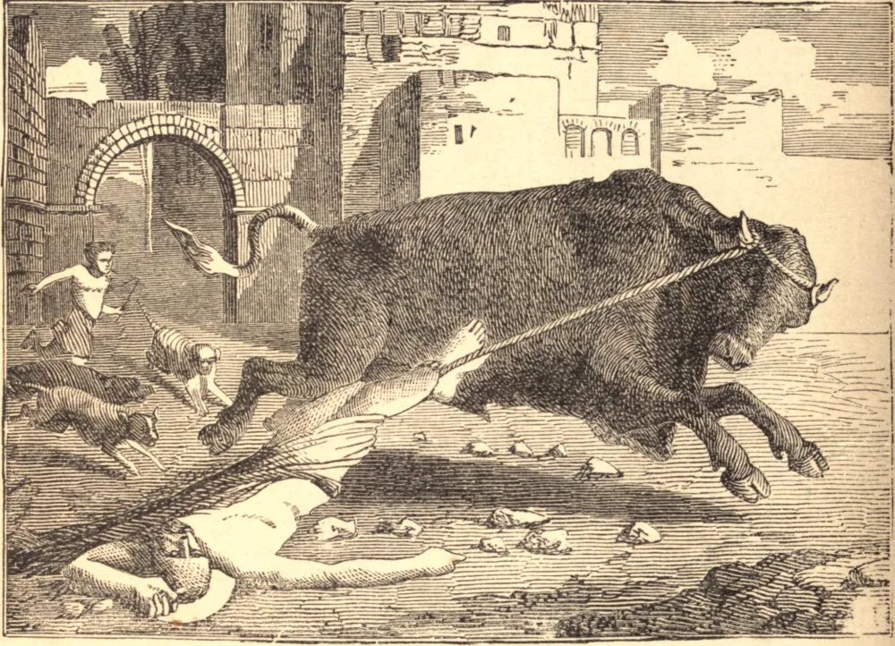

# November 29.—ST. SATURNINUS, Martyr

SATURNINUS went from Rome, by direction of Pope Fabian, about the year 245, to preach the faith in Gaul. He fixed his episcopal see at Toulouse, and thus became the first Christian bishop of that city. There were but few Christians in the place. However, their number grew fast after the coming of the Saint; and his power was felt by the spirits of evil, who received the worship of the heathen. His power was felt the more because he had to pass daily through the capitol, the high place of the heathen worship, on the way to his own church. One day a great multitude was gathered by an altar, where a bull stood ready for the sacrifice. A man in the crowd pointed out Saturninus, who was passing by, and the people would have forced him to idolatry; but the holy bishop answered: "I know but one God, and to Him I will offer the sacrifice of praise. How can I fear gods who, as you say, are afraid of me?" On this he was fastened to the bull, which was driven down the capitol. The brains of the Saint were scattered on the steps. His mangled body was taken up and buried by two devout women.

## Reflection

When beset by the temptations of the devil, let us call upon the Saints, who reign with Christ. They were powerful during their lives against the devil and his angels. They are more powerful now that they have passed from the Church on earth to the Church triumphant.
