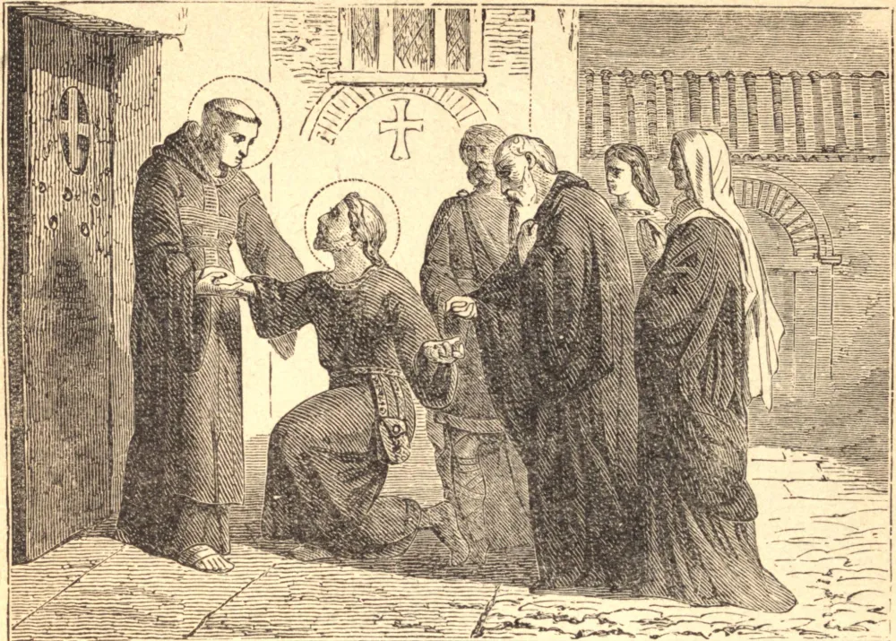

# October 24.—ST. MAGLOIRE, Bishop

ST. MAGLOIRE was born in Brittany towards the end of the fifth century. When he and his cousin St. Sampson came of an age to choose their way in life, Sampson retired into a monastery, and Magloire returned home, where he lived in the practice of virtue.

Amon, Sampson's father, having been cured by prayer of a dangerous disease, left the world, and with his entire family consecrated himself to God. Magloire was so affected at this that, with his father, mother, and two brothers, he resolved to fly the world, and they gave all their goods to the poor and the Church. Magloire and his father attached themselves to Sampson, and obtained his permission to take the monastic habit in the house over which he presided.

When Sampson was consecrated bishop, Magloire accompanied him in his apostolical labors in Armorica, or Brittany, and at his death he succeeded him in the Abbey of Dole and in the episcopal character. After three years he resigned his bishopric, being seventy years old, and retired into a desert on the continent, and some time after into the isle of Jersey, where he founded and governed a monastery of sixty monks. He died about the year 575.

**Reflection**—"Be mindful of them that have rule over you, who have spoken to you the word of God, whose faith follow, considering the end."
