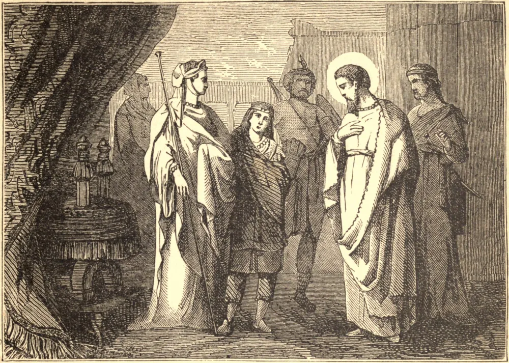

# October 27.—ST. FRUMENTIUS, Bishop

ST. FRUMENTIUS was yet a child when his uncle, Meropius of Tyre, took him and his brother Edesius on a voyage to Ethiopia. In the course of their voyage the vessel touched at a certain port, and the barbarians of that country put the crew and all the passengers to the sword, except the two children.

They were carried to the king, at Axuma, who, charmed with the wit and sprightliness of the two boys, took special care of their education; and, not long after made Edesius his cup-bearer, and Frumentius, who was the elder, his treasurer and secretary of state; on his death-bed he thanked them for their services, and in recompense gave them their liberty. After his death the queen begged them to remain at court, and assist her in the government of the state until the young king came of age.

Edesius went back to Tyre, but St. Athanasius ordained Frumentius Bishop of the Ethiopians, and vested with this sacred character he gained great numbers to the Faith, and continued to feed and defend his flock until it pleased the Supreme Pastor to recompense his fidelity and labors.

**Reflection**—"The soul that journeys in the light and the truths of the Faith is safe against all error."
