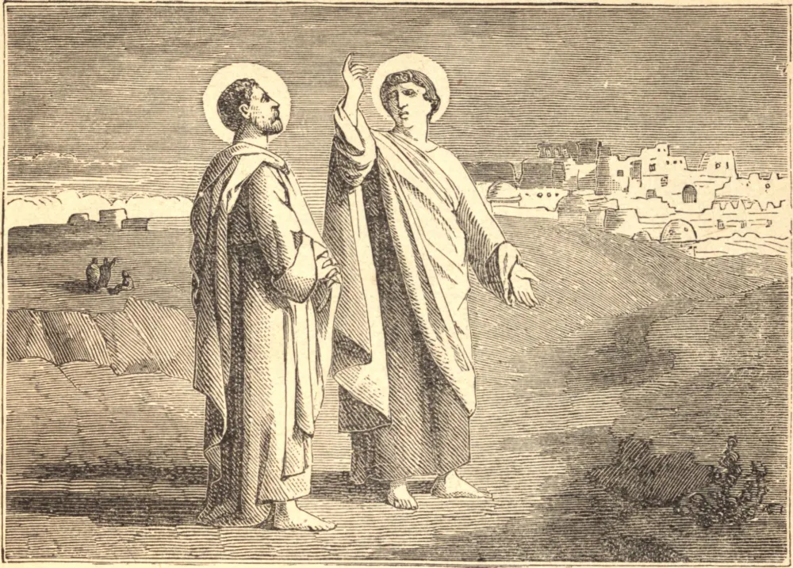

# October 28.—STS. SIMON and JUDE

SIMON was a simple Galilean, called by Our Lord to be one of the pillars of His Church. Zelotes, "the zealot," was the surname which he bore among the disciples. Armed with this zeal he went forth to the combat against unbelief and sin, and made conquest of many souls for His divine Lord.

The apostle Jude, whom the Church commemorates on the same day, was a brother of St. James the Less. They were called "brethren of the Lord," on account of their relationship to His Blessed Mother. St. Jude preached first in Mesopotamia, as St. Simon did in Egypt; and finally they both met in Persia, where they won their crown together.

**Reflection**—Zeal is an ardent love which makes a man fearless in defence of God's honor, and earnest at all costs to make known the truth. If we would be children of the Saints, we must be zealous for the Faith.
