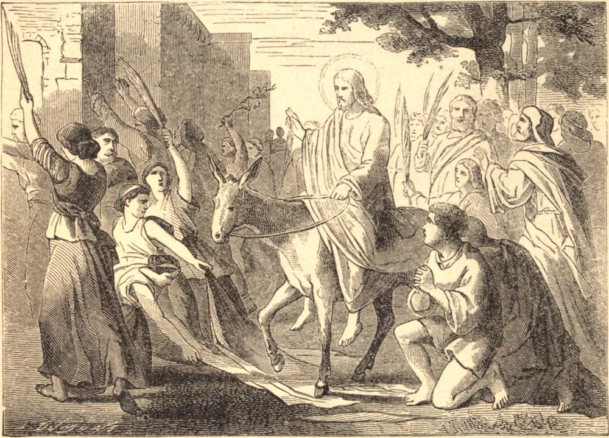

# Palm Sunday

Lessons without end, at once lofty and hallowing, might be deduced from the triumphant entry of Jesus Christ into Jerusalem, celebrated by the Church on this day; we limit ourselves, however, to considering the event under one aspect merely, in order to draw therefrom a moral lesson for our spiritual instruction. Jesus Christ enters Jerusalem, and the people forthwith improvise a triumph all the more noble because it has cost neither blood nor tears, and so much the more touching because it is spontaneous. The whole town is in commotion, the roadway is strewn with branches and covered with the garments of the bystanders, every mouth resounding with acclamations, and blessings, and praise. Jesus Christ is proclaimed the son of David, the King of the nation and the Messiah. Ere a few days are sped, the very people that had applauded now clamor for His death, curse and insult Him, and assist at His degrading death with fiendish cries of triumph.

Even thus pass away the glories of the world, its joys, its possessions, even life itself. To-day at the height of greatness, to-morrow in the deepest abasement; but yesterday the idol of a nation, to-day the object of its hate; now surrounded with prosperity, and yet a little while, borne down by misfortune; one day full of life and vigor, and the next consigned to the tomb. Foolish, then, are they who would account as of any value, or would cling to, things perishable! What bitter awakenings have not such poor deluded beings to expect, and what chagrin and tearful disappointments do they not create for themselves! The Christian who places the aim of his hopes and the centre of his affections at a higher range is both wiser and more happy. Prosperity does not blind nor inebriate him, since he knows it to be capricious and changeful; adverse fortune does not overwhelm him, because he was prepared for it and awaited it with calmness. The unforeseen alone affords any ground for fear; and to the faithful Christian there is nothing that is unforeseen.

## Reflection

The recommendation given by the great Apostle may be aptly brought to mind: "And they that weep be as though they wept not; and they that rejoice, as they rejoiced not; and they that use this world, as though they used it not; for the fashion of this world passeth away."
