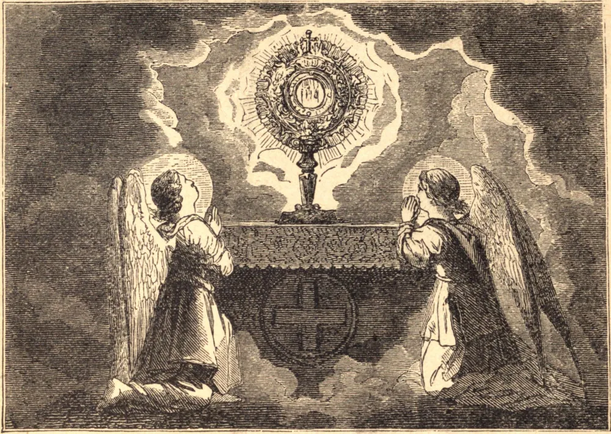

# Quinquagesima Sunday — The Forty Hours' Devotion

Quinquagesima Sunday is the third day preceding Ash Wednesday. That holy season is approaching when the Church denies herself her songs of joy in order the more forcibly to remind us, her children, that we are living in a Babylon of spiritual danger, and to excite us to regain that genuine Christian spirit which every thing in the world around us is striving to undermine. If we are obliged to take part in the amusements of the few days before Lent, let it be with a heart deeply imbued with the maxims of the Gospel. But, as a substitute for frivolous amusements and dangerous pleasures, the Church offers a feast surpassing all earthly enjoyments, and a means whereby we can make some amends to God for the insults offered to His divine majesty. The Lamb that taketh away the sins of the world is exposed upon our altars. On this His throne of mercy He receives the homage of those who come to adore Him and acknowledge Him for their King; He accepts the repentance of those who come to tell Him how grieved they are at having followed any other Master; and He offers Himself again to His Eternal Father as a propitiation for those sinners who yet treat His favors with indifference.

It was the pious Cardinal Gabriel Paleotti, Archbishop of Bologna, who, in the sixteenth century, first originated the admirable devotion of the Forty Hours. His object in this solemn exposition of the Most Blessed Sacrament was to offer to the Divine Majesty some compensation for the sins of man, and, at the very time when the world was busiest in deserving His anger, to appease it by the sight of His own Son, the Mediator between heaven and earth. Pope Benedict XIV. granted many indulgences to all the faithful of the Papal States who, during these days, should visit Our Lord in this mystery of His love, and should pray for the pardon of sinners. This favor, at first so restricted, afterward was extended by Pope Clement XIII. to the Universal Church. Thus the Forty Hours' Devotion has spread throughout the whole world and become one of the most solemn expressions of Catholic piety.

**Reflection**—Let us then go apart, for at least one short hour, from the dissipation of earthly enjoyments, and, kneeling in the presence of our Jesus, merit the grace to keep our hearts innocent and detached.
