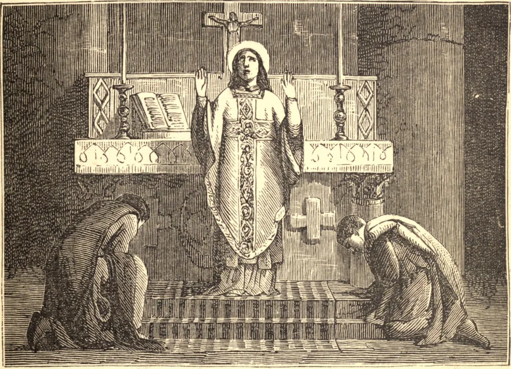

# September 10.—ST. NICHOLAS OF TOLENTINO

BORN in answer to the prayer of a holy mother, and vowed before his birth to the service of God, Nicholas never lost his baptismal innocence. His austerities were conspicuous even in the austere Order—the Hermits of St. Augustine—to which he belonged, and to the remonstrances which were made by his superiors he only replied, "How can I be said to fast, while every morning at the altar I receive my God?" He conceived an ardent charity for the Holy Souls, so near and yet so far from their Saviour; and often after his Mass it was revealed to him that the souls for whom he had offered the Holy Sacrifice had been admitted to the presence of God.

Amidst his loving labors for God and man, he was haunted by fear of his own sinfulness. "The heavens," said he, "are not pure in the sight of Him Whom I serve; how then shall I, a sinful man, stand before Him?" As he pondered on these things, Mary, the Queen of all Saints, appeared before him. "Fear not, Nicholas," she said, "all is well with you: my Son bears you in His Heart, and I am your protection." Then his soul was at rest; and he heard, we are told, the songs which the angels sing in the presence of their Lord. He died September 10, 1310.

**Reflection**—Would you die the death of the just? there is only one way to secure the fulfilment of your wish. Live the life of the just. For it is impossible that one who has been faithful to God in life should make a bad or an unhappy end.
