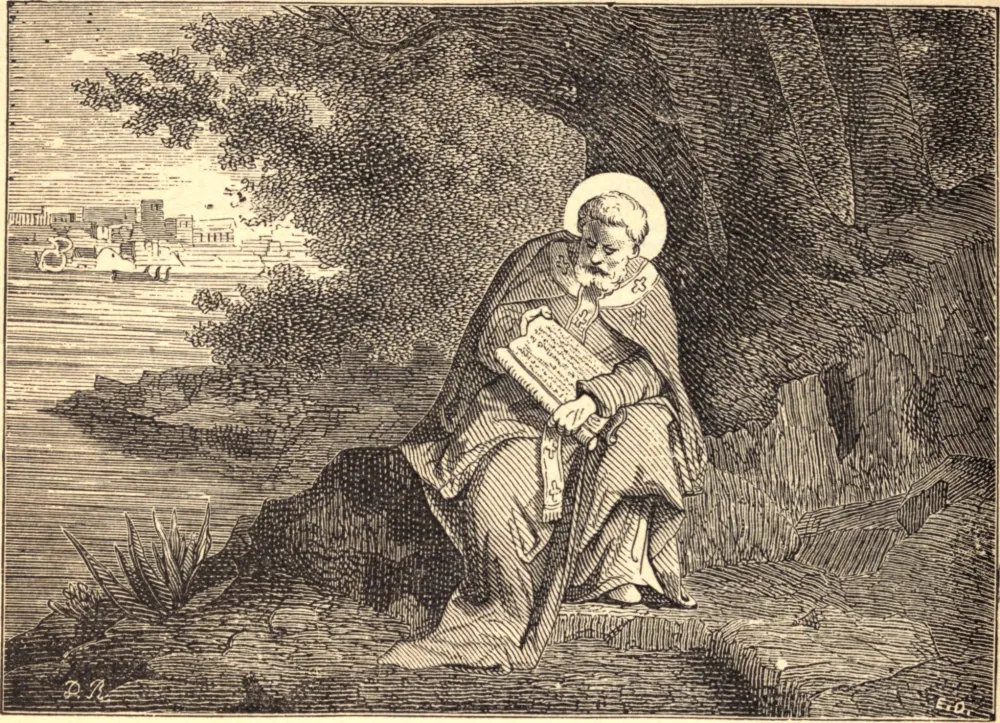

# September 16.—ST. CYPRIAN, Bishop, Martyr

CYPRIAN was an African of noble birth, but of evil life, a pagan, and a teacher of rhetoric. In middle life he was converted to Christianity, and shortly after his baptism was ordained priest, and made Bishop of Carthage, notwithstanding his resistance. When the persecution of Decius broke out, he fled from his episcopal city, that he might be the better able to minister to the wants of his flock, but returned on occasion of a pestilence. Later on he was banished, and saw in a vision his future martyrdom. Being recalled from exile, sentence of death was pronounced against him, which he received with the words "Thanks be to God." His great desire was to die whilst in the act of preaching the faith of Christ, and he had the consolation of being surrounded at his martyrdom by crowds of his faithful children. He was beheaded on the 14th of September, 258, and was buried with great solemnity. Even the pagans respected his memory.

## Reflection

The duty of almsgiving is declared both by nature and revelation: by nature, because it flows from the principle imprinted within us of doing to others as we would they should do to us; by revelation, in many special commands of Scripture, and in the precept of divine charity which binds us to love God for His own sake, and our neighbor for the sake of God.
