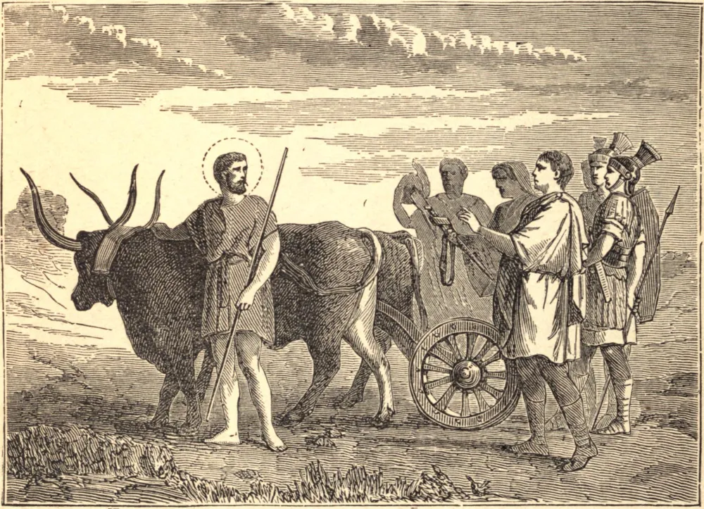

# September 20.—STS. EUSTACHIUS and Companions, Martyrs

EUSTACHIUS, called Placidus before his conversion, was a distinguished officer of the Roman army under the Emperor Trajan. One day, whilst hunting a deer, he suddenly perceived between the horns of the animal the image of our crucified Saviour. Responsive to what he considered a voice from heaven, he lost not a moment in becoming a Christian. In a short time he lost all his possessions and his position, and his wife and children were taken from him. Reduced to the most abject poverty, he took service with a rich land-owner to tend his fields. In the mean time the empire suffered greatly from the ravages of barbarians. Trajan sought out our Saint, and placed him in command of the troops sent against the enemy. During this campaign he found his wife and children, whom he despaired of ever seeing again. Returning home victorious, he was received in triumph and loaded with honors; but the emperor having commanded him to sacrifice to the false gods, he refused. Infuriated at this, Trajan ordered Eustachius with his wife and children to be exposed to two starved lions; but instead of harming these faithful servants of God, the beasts merely frisked and frolicked about them. The emperor, grown more furious at this, caused the martyrs to be shut up inside a brazen bull, under which a fire was kindled, and in this horrible manner they were roasted to death.

## Reflection

It is not enough to encounter dangers with resolution; we must with equal courage and constancy vanquish pleasure and the softer passions, or we possess not the virtue of true fortitude.
