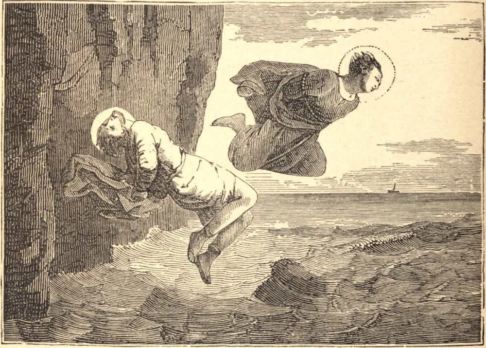

# September 27.—STS. COSMAS and DAMIAN, Martyrs

STS. COSMAS and DAMIAN were brothers, and born in Arabia, but studied the sciences in Syria, and became eminent for their skill in physic. Being Christians, and full of that holy temper of charity in which the spirit of our divine religion consists, they practised their profession with great application and wonderful success, but never took any fee. They were loved and respected by the people on account of the good offices received from their charity, and for their zeal for the Christian faith, which they took every opportunity to propagate. When the persecution of Diocletian began to rage, it was impossible for persons of so distinguished a character to lie concealed. They were therefore apprehended by the order of Lysias, Governor of Cilicia, and after various torments were bound hand and foot and thrown into the sea.

## Reflection

We may sanctify our labor or industry, if actuated by the motive of charity toward others, even whilst we fulfil the obligation we owe to ourselves and our families of procuring an honest and necessary subsistence, which of itself is no less noble a virtue, if founded in motives equally pure and perfect.
