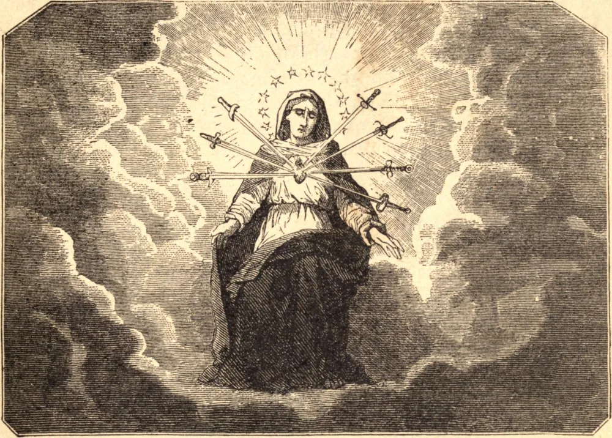

# The Seven Dolors of the Blessed Virgin

Eve had sacrificed to her caprice the spouse through whom she had received being; Mary assists at the sacrifice of the Son to whom she has given being. Eve was born of man without the agency of a mother; Mary gave birth to the man-God without the intervention of a spouse. Eve, after her disobedience, became the mother, in the order of nature, of a race accursed; Mary, through her submission, has become, in the order of grace, the mother of a race sanctified. These points of resemblance and contrast offer themselves spontaneously to the mind, provided we ponder somewhat over the remembrance celebrated by the Church on the Friday in Holy Week, under the title of the "Seven Dolors of the Blessed Virgin." A mother's heart can alone comprehend the agony of torture endured by this mother at the foot of the Cross whereon Her Son was immolated; we do not attempt to describe, nor are any mere human lips, indeed, able to express it.

## Reflection

Let us adore this divine and mysterious abyss of charity, in whose depth our salvation was worked out at the price of so much suffering; and let us bear in mind what we have cost that mother to whose guardianship we were made over, even from the sublime height of the cross.
