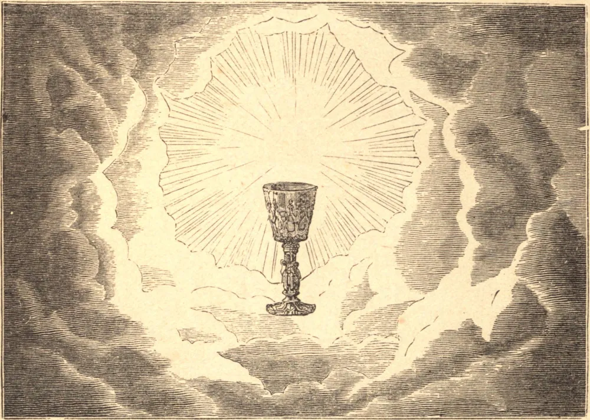

# The Most Precious Blood of Our Lord Jesus Christ

The Church, inspired by the Holy Ghost, has established a special feast in honor of the Most Precious Blood of Our Lord. This saving Blood was first shed at the circumcision of the Divine Infant; it was next poured out in the bloody sweat of agony in the Garden of Olives; again it flowed under the cruel blows of the savage soldiery; then when the crown of thorns was pressed into His temples; and finally, when "one of the soldiers with a spear opened His side, and there came out blood and water." St. Augustine, explaining these words of St. John, points out that the Evangelist does not use the words struck or wounded, but says distinctly, "one of the soldiers with a spear opened His side," that we may understand thereby that the gate of life was opened, and from that sacred side issued all those sacraments of the Church, without which we can never hope to gain eternal life. This Precious Blood was symbolized by the victim of the old law; but while these latter sacrifices served only to purify the outer man, the blood of Jesus Christ, by virtue of its infinite efficacy, washed us free from all sin, provided we avail ourselves of the means established by our Divine Saviour in His Church for the application of its infinite merits.

## Reflection

Let us haste then to profit by the graces offered us. Let us wash away the stains of sin in the Sacrament of Penance, and nourish ourselves with the Most Blessed Body and Blood of the Holy Eucharist. Let us ever be attentive at Mass, where this adorable Blood mystically pours forth again upon the altar to plead our cause before the throne of divine justice.
