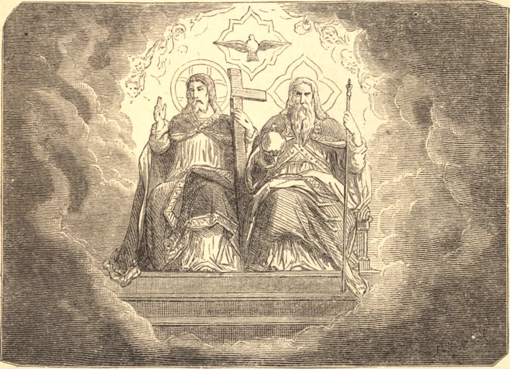

# Trinity Sunday

The Holy Trinity is one only God in three Persons, the Father, the Son, and the Holy Ghost, equal in all things and co-eternal. The Father gives being to the Son, and the Holy Ghost proceeds from the Father and the Son: the most adorable, truly, of all mysteries, and likewise the most impenetrable! St. Anselm has endeavored to explain it from a single point of view only, and has accomplished this in a masterly yet necessarily insufficient manner. The Father, he says, cannot exist a single instant without knowing Himself, because, in God, to know is to exist, even as to will is to act. This knowledge, personified, is "the Word," His Son. The Son is, then, co-eternal with the Father. The Father and the Son cannot exist a single instant without loving each other; their mutual love is again personified, because in God to love is still to exist, God being love itself. This third Person, thus co-eternal with the other two Persons, is the Holy Ghost. But the inhabitants with God can alone understand these wonders, and they understand because they see them. The free-thinker, surrounded by the mysteries of nature, and who is to himself a complete mystery, is not willing to admit of any in religion. "I only wish to believe," he says, "what I understand!" The poor fool would not believe much were he taken at his word. He would neither believe in the food he takes, seeing that he could not explain how it imparts nourishment, nor in the light of the sun, since he does not apprehend how it brings him into relation with distant objects, nor even in his own arguments, since he does not comprehend how his mind evokes and gives them shape. Literally speaking, there exist no mysteries, there are only truths; but truth becomes a mystery to him who does not understand it. Writing is a mystery to one who knows not how to read; it ceases to be so to any one who has received instruction. According as we educate the soul and widen the measure of knowledge, mysteries begin to disappear in proportion; therefore is it that there are no mysteries in heaven, because the angels and the blessed behold with open gaze the objects whereof we now possess but the mysterious definition. To deserve to behold them one day in their heavenly company, one condition is requisite, namely, to adore them meanwhile with steadfast and perfect faith in the Word of God, which proposes them for our belief. In the realms of nature, a mystery is a truth not understood, which one believes withal because one sees it. In the sphere of religion, a mystery is a truth not understood, which one believes because God has revealed it.

## Reflection

Wherefore rebel against the word of God? Is it not "as if the clay should rebel against the potter, and the work should say to the worker thereof, Thou understandest not?"
