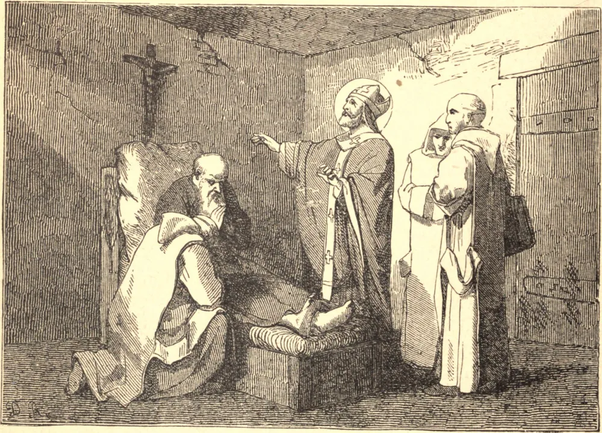

# 1 de abril — SANTO HUGO, Bispo

FOI a ventura deste Santo receber, desde o berço, as mais fortes impressões de piedade pelo exemplo e pelo cuidado de seus ilustres e santos pais. Nasceu em Châteauneuf, no território de Valence, no Delfinado, em 1053. Seu pai, Odilo, que serviu à pátria num honroso posto do exército, esforçou-se por todos os meios ao seu alcance por fazer de seus soldados fiéis servos de seu Criador, e por refrear o vício com severos castigos. Por conselho de seu filho, Santo Hugo, ele se tornou mais tarde monge cartuxo, e morreu com a idade de cem anos, tendo recebido a Extrema-Unção e o Viático das mãos de seu filho. Nosso Santo igualmente assistiu, em seus últimos momentos, sua mãe, que por muitos anos, sob sua direção, servira a Deus em sua própria casa, pela oração, pelo jejum e por abundantes esmolas.

Hugo, desde o berço, parecia ser uma criança de bênção. Cumpriu seus estudos com grandes louvores, e, tendo escolhido servir a Deus no estado eclesiástico, aceitou um canonicato na catedral de Valence. Sua grande santidade e seu saber tornaram-no um ornamento daquela igreja, e foi por fim feito Bispo de Grenoble. Pôs-se imediatamente a repreender o vício e a reformar os abusos, e tão abundante foi a bênção do Céu sobre seus labores que teve o consolo de ver a face de sua diocese em pouco tempo extraordinariamente mudada.

Após dois anos, renunciou em particular ao seu bispado, presumindo o consentimento tácito da Santa Sé, e, vestindo o hábito de São Bento, deu início a um noviciado na austera abadia de Casa-Dei, em Auvergne. Ali viveu um ano, perfeito modelo de todas as virtudes para aquela casa de Santos, até que o Papa Gregório VII lhe ordenou, em virtude da santa obediência, que retomasse seu encargo pastoral.

Solicitou com empenho ao Papa Inocêncio II licença para renunciar ao seu bispado, a fim de poder morrer em solidão, mas nunca conseguiu obter seu pedido. Aprouve a Deus purificar sua alma por uma demorada enfermidade antes de chamá-lo a Si. Algum tempo antes de sua morte, perdeu a memória de tudo, exceto de suas orações. Encerrou seu curso penitencial no dia 1º de abril de 1132, faltando-lhe apenas dois meses para completar oitenta anos de idade, dos quais fora bispo por cinquenta e dois anos. Milagres atestaram a santidade de sua feliz morte, e foi canonizado por Inocêncio II em 1134.

**Reflexão**—Aprendamos com o exemplo dos Santos a fugir do tumulto do mundo tanto quanto nossas circunstâncias o permitam, e a entregar-nos aos exercícios da santa solidão, da oração e da leitura piedosa.
